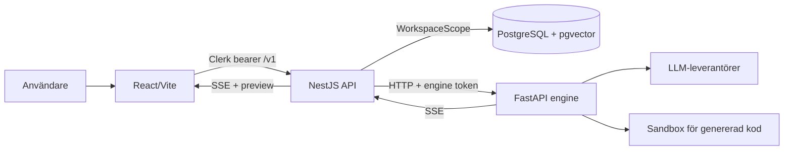

# Production Readiness Review

## 1. Dokumentinformation

| Fält | Värde |
|---|---|
| Datum | 2026-08-24 |
| Repository | Scio — AI app builder, monorepo med `apps/api`, `apps/engine`, `apps/app` och `packages/shared` |
| Granskad revision | Arbetskopian i `C:\Robotics\Scio`. Branch och commit kunde inte verifieras eftersom `git` saknas i PATH. |
| Omfattning | Applikationskod, datamodell och 12 migreringar, tester, CI, scripts, lokal drift, säkerhet, integritet, kostnad, dokumentation och produktflöden. |
| Metod | Evidensbaserad statisk granskning av implementation och testkod, jämförd med PRD, arkitektur, ADR:er, roadmap, backlog och tidigare reviewdokument. |
| Prioritering | P0 kritisk akut risk; P1 blockerar eller bör blockera produktion; P2 hög risk som ska åtgärdas före eller omedelbart efter begränsad release; P3 förbättring/underhåll. |

### Begränsningar

- Build, lint och test kunde inte köras: `pnpm`, `node_modules` och engine-`.venv` saknas; system-Python saknar `pytest` och `ruff`. Installationer och externa anrop var uttryckligen förbjudna.
- `git` saknas, så revision, status och historik kunde inte verifieras.
- `.env.example`-filer blockerades av granskningsmiljön. Konfigurationsbedömningen bygger därför på kodens faktiska env-läsning.
- Inga tjänster, databaser, containrar, sandboxes eller riktiga modellleverantörer startades. Prestanda, faktisk molnisolering, migrationskörning och fullständiga användarflöden är inte runtime-verifierade.
- CVE-, licens-, paketproveniens- och molnprisdata kräver extern verifiering. Frånvaro av ett statiskt fynd är inte bevis på säkerhet.

---

## 2. Executive summary

Scio har en ovanligt genomarbetad applikationskärna för sitt stadium: tydliga domänobjekt, central autentisering, workspace-scope för direkt tenantägda modeller, databas-enforcerade versionsinvarianter, kostnadsmätning, byggjobb, idempotens, fail-closed dev-auth/engine-token och flera sandboxskydd. Fresh-clone-CI och den omfattande testkoden visar god ingenjörsdisciplin.

Systemet är ändå **inte produktionsklart**. Det finns ingen produktionsdriftsättning, inga runtime-images eller IaC för app/API/engine. Den avsedda ACA-sandboxen är en oanropad stub, och den enda implementerade isolerande vägen saknar default-deny-nätverk. Dessutom finns två konkreta fel i byggflödet: idempotensreplay kan ske före tenantverifiering, och en aktiv lång byggning kan felaktigt reapas eftersom engine-keepalive inte uppdaterar jobbets persistenta heartbeat.

Driftbarheten är också otillräcklig: ingen sammanhängande observability, ingen readiness som failar, API:t startar utan databas, och långvarigt arbete ligger i HTTP-processen utan kö/worker. Dataskydd, webhookverifiering, runtime-validering för flera DTO:er samt ett antal publikt exponerade produktfunktioner är ofullständiga.

**Antal fynd:** P0: 0 · P1: 5 · P2: 9 · P3: 4.

**Rekommendation:** **NO-GO för publik produktion.** En stängd intern alfa är möjlig först när en reproducerbar deploy, verklig isolering och F-03/F-04 är åtgärdade och verifierade i en ren miljö.

---

## 3. Produktionsbedömning

### Bedömning: **NOT READY**

| Dimension | Bedömning | Motivering |
|---|---|---|
| Funktionell kärna | Delvis redo | Intake, spec, design och build/reveal är implementerade; deploy, reference, settings och flera ytor är stubs eller placeholders. |
| Säkerhet | Inte redo | Untrusted kod saknar verifierad produktionssandbox/egresspolicy; konkret tenant-auktoriseringslucka finns i replayflödet. |
| Data/integritet | Inte redo | Projekt-soft-delete finns, men konto-/workspace-radering och retention saknas. |
| Tillförlitlighet | Inte redo | Heartbeat/reaper kan skapa samtidiga byggen; långvarigt arbete är bundet till API-requesten. |
| Drift/observability | Inte redo | Ingen produktionsdeploy, readiness, metrics, tracing, korrelations-id eller larm. |
| Testbarhet | Lovande men ej verifierad | Bred testkod och CI finns, men ingen baseline kunde köras i granskningsmiljön. |
| Kostnadskontroll | Delvis redo | Per-build- och periodtak finns, men periodtaket är icke-atomiskt och reveal kan visa fel spend. |

Publik produktion förutsätter minst stängning av samtliga P1-fynd samt P2-fynd som rör webhook, datalivscykel och input-/webbsäkerhet. Produktens egen [roadmap](docs/ROADMAP.md) och [backlog](docs/BACKLOG.md) beskriver fortfarande deployment, sandbox, nätverkspolicy och observability som öppna arbeten.

---

## 4. Systemöversikt

Scio omvandlar en naturlig språkbeskrivning till en fryst specifikation, en valfri interaktiv designversion och slutligen en genererad app. Kärnflödet är:

1. React-klienten autentiserar via Clerk och anropar ett versionerat NestJS-API.
2. API:t provisionerar användare/workspace, tillämpar tenant-scope och persisterar projektdata i PostgreSQL/pgvector.
3. API:t skickar intake-, design- och buildarbete till FastAPI-engine med delad token.
4. Engine kör Layer B/C, modellrelay, verifieringsgrindar och genererad kod i vald sandbox.
5. Buildhändelser relayas som SSE; resultat, kostnad och versionspekare sparas.
6. Frontend visar preview/reveal och förbereder leverans.

**Primär objektlivscykel:** `Workspace` → `Project` → `SpecVersion` → `DesignVersion` → `BuildJob` → `BuildVersion` → `Deployment`. Sidoobjekt omfattar meddelanden, referensassets/embeddings, usage events, notifications och audit logs; se [Prisma-schemat](apps/api/prisma/schema.prisma).

---

## 5. Teknisk inventering

| Del | Teknik | Huvudansvar | Status |
|---|---|---|---|
| Webbapp | React 18, TypeScript, Vite 5, Tailwind, React Router, Clerk | Dashboard, wizard, review, design, build, reveal, ship | Kärnflöde implementerat; flera placeholders |
| API | NestJS 10, Prisma 5, PostgreSQL, SSE | Auth, tenancy, orkestrering, versionsdata, usage | Omfattande; flera stubs och driftrisker |
| Engine | Python, FastAPI, Pydantic, LLM-providers | Layer B/C, generering, verifiering, preview/sandbox | Lokal väg implementerad; produktionsprovider saknas |
| Delat kontrakt | TypeScript, class-validator | API/app-typer och vissa runtime-DTO:er | Blandning av klasser och raderade interfaces |
| Databas | PostgreSQL 16 + pgvector | Produktdata, versioner, usage, RAG | Bra constraints/index; retention saknas |
| CI | GitHub Actions | Fresh-clone install, typkontroll, Ruff, pytest, API/app-test | Ingen audit/SAST/secret-scan/CD |
| Lokal drift | Bash, devcontainer, Compose | Lokal helstack och enbart DB via Compose | Inte produktionsartefakter |
| Dokumentation | PRD, arkitektur, ADR:er, roadmap, backlog, runbooks | Beslut och status | Omfattande men vissa statusar motsäger implementation |

Externa beroenden är Clerk, PostgreSQL/pgvector, modellleverantörer, npm/Python-paketregister och avsedd Azure Container Apps Dynamic Sessions.

---

## 6. Positiva observationer (INFO)

- `WorkspaceScope` failar stängt för okända operationer på direkt workspace-scopeade modeller och stämplar creates med `workspaceId` ([workspace-scope.ts](apps/api/src/auth/workspace-scope.ts#L19-L83)).
- Global autentiseringsguard, 404-beteende för främmande projekt och CORS-allow-list minskar exponeringsytan.
- Engine-token jämförs timingsäkert och engine vägrar produktionsstart utan token ([main.py](apps/engine/src/scio_engine/main.py#L96-L124)).
- Sandboxkod har env-allow-list, path traversal-skydd, resursgränser och vägrar lokal processprovider i produktion ([sandbox.py](apps/engine/src/scio_engine/core/sandbox.py#L141-L151), [sandbox.py](apps/engine/src/scio_engine/core/sandbox.py#L235-L266), [sandbox.py](apps/engine/src/scio_engine/core/sandbox.py#L393-L410)).
- Partiella unika index skyddar en aktuell spec/design/build per projekt, en live build job per projekt och idempotens för färdiga byggen; migreringarna kompletterar Prisma med DB-invarianter.
- BuildJob skapas före arbetet, cancellation finns, misslyckad/avbruten modellkostnad försöker mätas och per-build-budget skickas till engine.
- CI installerar från ren clone utan cache, bygger det gitignorerade shared-paketet och kör TypeScript-, Ruff-, pytest-, API- och appkontroller ([ci.yml](.github/workflows/ci.yml#L22-L72)).
- UI-koden har explicita loading-, empty- och error-tillstånd på centrala flöden, och generated-app-resultat beskriver även kvarvarande problem i stället för att bara rapportera framgång.

Dessa kontroller ska behållas, men de neutraliserar inte fynden nedan.

---

## 7. Sammanställning av fynd

| ID | Prio | Kategori | Rubrik | Status | Produktionsblockerande | Insats |
|---|---|---|---|---|---|---|
| F-01 | P1 | Deployment | Ingen produktionsdeploy, runtime-image eller IaC | Verifierat | Ja | L |
| F-02 | P1 | Sandbox/säkerhet | Produktionssandbox saknas; ingen default-deny-egress | Verifierat | Ja | L |
| F-03 | P1 | Tenantisolering | Idempotensreplay sker före projektägarskap | Verifierat | Ja | S |
| F-04 | P1 | Tillförlitlighet | Aktiv byggning kan reapas under legitim tystnad | Verifierat | Ja | M |
| F-05 | P1 | Observability | Ingen end-to-end-telemetri eller larm | Verifierat | Ja | M |
| F-06 | P2 | Arkitektur | Build körs inline i API-request utan kö/worker | Verifierat | Villkorligt | L |
| F-07 | P2 | Drift/config | API failar öppet vid DB-fel; health är missvisande; shutdown ej aktiverad | Verifierat | Villkorligt | S–M |
| F-08 | P2 | Webhooks | Clerk-signaturen verifieras inte kryptografiskt | Verifierat | Villkorligt | S |
| F-09 | P2 | Kostnad | Periodtaket är icke-atomiskt och summeras i minnet | Verifierat | Nej | M |
| F-10 | P2 | Korrekthet/kostnad | Reveal kan koppla fel usage event till ett buildresultat | Verifierat | Nej | S |
| F-11 | P2 | Input/API | Flera requesttyper saknar runtime-validering och storleksgränser | Verifierat | Villkorligt | M |
| F-12 | P2 | Webbsäkerhet | Preview-iframe, headers och Swagger-härdning saknas | Verifierat | Villkorligt | S–M |
| F-13 | P2 | Data/compliance | Konto-/workspace-radering och retention saknas | Verifierat | Villkorligt | M–L |
| F-14 | P2 | Produkt | Exponerade endpoints och utlovade ytor är stubs/placeholders | Verifierat | Nej | M–L |
| F-15 | P3 | Supply chain | CI saknar säkerhetsskanning; två Python-paket kräver proveniensverifiering | Delvis verifierat | Nej | S–M |
| F-16 | P3 | Concurrency | Provisionering och jobbstart hanterar inte unika race explicit | Sannolik risk | Nej | S |
| F-17 | P3 | UX/a11y | Projektval är klickbara `div` utan tangentbordssemantik | Verifierat | Nej | S |
| F-18 | P3 | Dokumentation/underhåll | Statusdrift och kommande TypeScript-konfigurationsskuld | Verifierat | Nej | S |

---

## 8. Detaljerade fynd

### [F-01] Ingen produktionsdeploy, runtime-image eller IaC

| Fält | Bedömning |
|---|---|
| Prioritet/kategori | P1 · Deployment |
| Status | Verifierat problem |
| Risk | Sannolikhet hög · Konsekvens hög · Säkerhet hög · Insats L |
| Produktionsblockerande | Ja |

**Evidens.** [docker-compose.yml](docker-compose.yml) innehåller endast PostgreSQL. Inga produktions-Dockerfiles eller IaC-filer finns för app/API/engine. [ROADMAP](docs/ROADMAP.md) och [BACKLOG](docs/BACKLOG.md) markerar deployment B079 som öppet. [dev-up.sh](scripts/dev-up.sh#L1-L16) säger uttryckligen att scriptet inte ändrar vad som skeppas.

**Problem.** Det finns ingen reproducerbar build/release/runtime för produkten som helhet.

**Produktionskonsekvens.** Ingen publik URL, deterministisk release, rollback, miljöseparation eller verifierad migrationsordning.

**Realistiskt scenario.** En release måste sättas ihop manuellt på en okänd värd; fel version av shared-kontrakt eller schema körs och rollback saknas.

**Grundorsak.** Projektet befinner sig före roadmapens deploymentfas.

**Rekommenderad åtgärd.** Skapa minimala multi-stage-images, IaC för valt Azure-mål, managed secrets, ingress/TLS, DB-backup och en CD-pipeline där migrationskontroll föregår rollout.

**Verifiering.** Deploya från ren clone till staging, kör smoke/e2e, verifiera rollback och återställning från backup.

**Beroenden och följdrisker.** Förutsättning för F-02, F-05 och realistisk prestanda-/resilienstestning.

---

### [F-02] Produktionssandbox saknas; ingen default-deny-egress

| Fält | Bedömning |
|---|---|
| Prioritet/kategori | P1 · Sandbox/säkerhet |
| Status | Verifierat problem |
| Risk | Sannolikhet medel · Konsekvens kritisk · Säkerhet hög · Insats L |
| Produktionsblockerande | Ja |

**Evidens.** `AcaSandbox.start`, `apply_change` och `stop` kastar alltid `SandboxError` ([aca_sandbox.py](apps/engine/src/scio_engine/core/aca_sandbox.py#L63-L81)); inga produktionsanropare använder klassen. Lokal process är uttryckligen ingen isoleringsgräns ([sandbox.py](apps/engine/src/scio_engine/core/sandbox.py#L141-L151)). Docker har CPU/minne/PID/no-new-privileges men kommentaren konstaterar att nätverkspolicy saknas ([sandbox.py](apps/engine/src/scio_engine/core/sandbox.py#L235-L266)).

**Problem.** LLM-genererad, opålitlig kod kan inte köras med den avsedda per-session-isoleringen. Implementerad Docker-väg har utgående nät.

**Produktionskonsekvens.** SSRF, metadataåtkomst, dataexfiltration, resursmissbruk och blast radius mot delad värd/interna tjänster.

**Realistiskt scenario.** Genererad eller promptinjicerad kod anropar molnmetadata eller intern API-adress från sandboxen och skickar resultat externt.

**Grundorsak.** ADR-målet är dokumenterat men providern är ännu bara ett skelett.

**Rekommenderad åtgärd.** Implementera och integrera ACA Dynamic Sessions eller likvärdig hård isolering, default-deny-egress med explicit allow-list, kortlivade identiteter, read-only/minsta filsystem och säkra teardown-gränser.

**Verifiering.** Kör negativa tester mot metadata, RFC1918, DNS-rebinding och obehöriga destinationsdomäner; genomför escape-/secret-exfiltrationstest och verifiera teardown.

**Beroenden och följdrisker.** Kräver F-01. Ingen publik modellgenerering bör öppnas innan detta är godkänt.

---

### [F-03] Idempotensreplay sker före projektägarskap

| Fält | Bedömning |
|---|---|
| Prioritet/kategori | P1 · Tenantisolering |
| Status | Verifierat problem |
| Risk | Sannolikhet låg–medel · Konsekvens hög · Säkerhet hög · Insats S |
| Produktionsblockerande | Ja |

**Evidens.** `ensureCanStart()` anropar `buildFor()` före `project()` ([build.service.ts](apps/api/src/modules/build/build.service.ts#L193-L224)); `run()` gör samma replay före ägarkontroll ([build.service.ts](apps/api/src/modules/build/build.service.ts#L504-L527)). `buildFor()` frågar `BuildVersion` på `projectId` + nyckel ([build.service.ts](apps/api/src/modules/build/build.service.ts#L365-L372)), men `BuildVersion` finns inte bland direkt scopeade modeller ([workspace-scope.ts](apps/api/src/auth/workspace-scope.ts#L13-L28)). Replay lämnar ut status, git-sha och kostnad ([build.service.ts](apps/api/src/modules/build/build.service.ts#L329-L361)). Klientnyckeln är en UUID ([api.ts](apps/app/src/lib/api.ts#L69-L79)), vilket minskar men eliminerar inte risken.

**Problem.** Auktorisering beror här på svårgissad nyckel i stället för verifierat tenantägarskap.

**Produktionskonsekvens.** En autentiserad tenant som får kännedom om ett annat projekts id och idempotensnyckel kan läsa buildmetadata och få ett främmande resultat replayat.

**Realistiskt scenario.** En nyckel läcker genom browserlogg/supportdump. En annan användare återanvänder projekt-id och nyckel mot buildendpointen.

**Grundorsak.** Barnmodeller scopeas genom servicedisciplin, men replayoptimeringen lades före den disciplinen. Testdoublen är striktare än riktiga Prisma-scopet och maskerar fallet.

**Rekommenderad åtgärd.** Kör `project(workspaceId, projectId)` före alla replayfrågor och/eller gör `BuildVersion` relationellt tenant-scopead. Lägg regressionstest med en buildversion i tenant A och samma id/nyckel från tenant B.

**Verifiering.** Cross-tenant-försök ska alltid ge 404 och aldrig anropa replay/engine; kör mot verklig Prisma/PostgreSQL, inte bara fake-scope.

**Beroenden och följdrisker.** Samma mönster ska sökas i alla barnmodeller och framtida cache-/idempotensvägar.

---

### [F-04] Aktiv byggning kan reapas under legitim tystnad

| Fält | Bedömning |
|---|---|
| Prioritet/kategori | P1 · Tillförlitlighet |
| Status | Verifierat problem |
| Risk | Sannolikhet medel · Konsekvens hög · Säkerhet hög · Insats M |
| Produktionsblockerande | Ja |

**Evidens.** Jobb reapas efter 15 minuter utan uppdaterat `heartbeatAt` ([build.service.ts](apps/api/src/modules/build/build.service.ts#L374-L388), [build.service.ts](apps/api/src/modules/build/build.service.ts#L427-L448)). API:t uppdaterar heartbeat endast i relay av parserade engine-event ([build.service.ts](apps/api/src/modules/build/build.service.ts#L570-L608)). Engine skickar standard-SSE-kommentar var 15:e sekund under tyst arbete ([main.py](apps/engine/src/scio_engine/main.py#L696-L726)), men `parseFrame()` returnerar `null` för ramar utan `data:` ([engine.client.ts](apps/api/src/engine/engine.client.ts#L162-L176)). Layer B/C körs före första `started`-eventet ([pipeline.py](apps/engine/src/scio_engine/builder/pipeline.py#L204-L251)).

**Problem.** Transporten lever, men den persistenta jobbpulsen gör det inte. Legitima modell-/paketsteg kan vara längre än graceperioden.

**Produktionskonsekvens.** Aktivt jobb markeras misslyckat och nytt jobb kan startas mot samma workspace; filerna kan raderas/korrumperas och dubbel modellkostnad uppstår.

**Realistiskt scenario.** En 20-minuters Layer B/C pågår. Användaren försöker igen efter reload; `reapStaleJobs()` frigör låset och ett andra bygge startar.

**Grundorsak.** SSE-keepalive och domänheartbeat implementerades separat utan gemensamt kontrakt.

**Rekommenderad åtgärd.** Propagera keepalive till en callback som uppdaterar jobbet eller inför engine lease/heartbeat oberoende av domänevent. Gör reaping med ägarskap/lease-token så gammal process inte kan persistera efter reaping.

**Verifiering.** Integrationstest med över 15 min simulerad tystnad och kommentarframes; nytt bygge ska nekas och originaljobbet ska förbli live.

**Beroenden och följdrisker.** Bör lösas tillsammans med worker/lease-modellen i F-06.

---

### [F-05] Ingen end-to-end-telemetri eller larm

| Fält | Bedömning |
|---|---|
| Prioritet/kategori | P1 · Observability |
| Status | Verifierat problem |
| Risk | Sannolikhet hög · Konsekvens hög · Säkerhet hög · Insats M |
| Produktionsblockerande | Ja |

**Evidens.** API/engine använder huvudsakligen standardlogger/stdout. Inga implementerade metrics, traces, request/build-correlation-id, dashboards eller larm hittades. [BACKLOG](docs/BACKLOG.md) har observability B123 öppet. API-health är enda DB-proben ([health.controller.ts](apps/api/src/health/health.controller.ts#L11-L26)).

**Problem.** Ett flerkomponents, minutlångt och kostnadsdrivande flöde kan inte följas eller larmas sammanhängande.

**Produktionskonsekvens.** Fel, köbildning, leverantörsdegradering, säkerhetshändelser och kostnadsavvikelser upptäcks sent och blir svåra att rotorsaka.

**Realistiskt scenario.** Modellleverantören börjar time-outa. Användare ser blandade SSE-fel men operatören saknar felkvot, korrelation och alert.

**Grundorsak.** Telemetri är uppskjuten till deploymentfasen.

**Rekommenderad åtgärd.** Inför strukturerade loggar, request/build-id genom app→API→engine→sandbox, OpenTelemetry-spår, metrics för latency/fel/kostnad/jobbstater och SLO-baserade larm utan prompt-/PII-innehåll.

**Verifiering.** Följ ett bygge i ett enda trace, injicera DB-/enginefel och verifiera larm samt redaction.

**Beroenden och följdrisker.** Bör levereras med F-01; krävs för säker release och incidenthantering.

---

### [F-06] Build körs inline i API-request utan kö/worker

| Fält | Bedömning |
|---|---|
| Prioritet/kategori | P2 · Arkitektur/resiliens |
| Status | Verifierat problem |
| Risk | Sannolikhet hög · Konsekvens hög · Säkerhet hög · Insats L |
| Produktionsblockerande | Villkorligt |

**Evidens.** `BuildService.run()` öppnar jobb och väntar sedan direkt på `engine.streamBuild()`/`promoteBuild()` i requestprocessen ([build.service.ts](apps/api/src/modules/build/build.service.ts#L504-L556), [build.service.ts](apps/api/src/modules/build/build.service.ts#L614-L637)). B094 i [BACKLOG](docs/BACKLOG.md) beskriver queue/worker som öppet.

**Problem.** `BuildJob` gör tillståndet durabelt men själva exekveringen är fortfarande bunden till API-instans och HTTP-livscykel.

**Produktionskonsekvens.** Deploy/restart av API avbryter arbete; horisontell skalning, backpressure, retry och rättvis schemaläggning blir svåra.

**Realistiskt scenario.** En vanlig rollout under ett 40-minutersbygge stänger requesten; jobb och spend blir inkonsistenta och användaren måste försöka igen.

**Grundorsak.** Jobbraden infördes före separat exekveringsplan.

**Rekommenderad åtgärd.** Flytta exekvering till idempotent worker med durabel kö, lease, cancellation, retry-policy och separat eventlogg; SSE läser jobb/events i stället för att äga arbetet.

**Verifiering.** Starta bygge, döda API och worker var för sig, skala ut, återuppta utan dubbelt arbete eller dubbeldebitering.

**Beroenden och följdrisker.** Samordna med F-04 och F-05.

---

### [F-07] API failar öppet vid DB-fel; health är missvisande; shutdown ej aktiverad

| Fält | Bedömning |
|---|---|
| Prioritet/kategori | P2 · Drift/config |
| Status | Verifierat problem |
| Risk | Sannolikhet medel · Konsekvens hög · Säkerhet hög · Insats S–M |
| Produktionsblockerande | Villkorligt |

**Evidens.** `PrismaService.onModuleInit()` loggar saknad/otillgänglig DB och fortsätter ([prisma.service.ts](apps/api/src/prisma/prisma.service.ts#L17-L31)). `/health` returnerar alltid `status: "ok"` även för `db: "error"` eller `not_configured` ([health.controller.ts](apps/api/src/health/health.controller.ts#L16-L26)). `onModuleDestroy()` finns, men bootstrap anropar inte `app.enableShutdownHooks()` ([main.ts](apps/api/src/main.ts#L21-L51)). Ingen samlad env-schemavalidering syns.

**Problem.** Process-liveness blandas med readiness och kritisk konfiguration är inte fail-fast.

**Produktionskonsekvens.** Orchestrator kan routa trafik till en oanvändbar instans; deploy kan tappa aktiva anslutningar/frågor.

**Realistiskt scenario.** Fel `DATABASE_URL` ger grön health, trafik släpps på och alla produktanrop börjar ge 500.

**Grundorsak.** Lokal skeleton-kompatibilitet har prioriterats över produktionsprofil.

**Rekommenderad åtgärd.** Validera env vid start, faila produktion utan DB/token/origins, separera `/live` och `/ready`, returnera 503 när beroenden är nere och aktivera shutdown hooks/drain.

**Verifiering.** Boota med saknade/felaktiga env, bryt DB under drift och skicka SIGTERM under request; kontrollera statuskoder och graceful drain.

**Beroenden och följdrisker.** Deploymentprober i F-01 måste använda readiness, inte nuvarande health.

---

### [F-08] Clerk-signaturen verifieras inte kryptografiskt

| Fält | Bedömning |
|---|---|
| Prioritet/kategori | P2 · Webhooks/säkerhet |
| Status | Verifierat problem |
| Risk | Sannolikhet medel · Konsekvens hög när handlern aktiveras · Säkerhet hög · Insats S |
| Produktionsblockerande | Villkorligt |

**Evidens.** Den publika webhooken kontrollerar endast att `svix-signature` finns när secret är satt och har explicit TODO för faktisk verifiering ([webhook.controller.ts](apps/api/src/auth/webhook.controller.ts#L29-L48)). `user.deleted` loggas men behandlas inte.

**Problem.** Vilken sträng som helst i signaturheadern accepteras. Raw body/timestamp/replayverifiering saknas.

**Produktionskonsekvens.** När webhooken får sidoeffekter kan en anonym angripare fejka Clerk-event, inklusive radering eller provisionering.

**Realistiskt scenario.** Cleanup implementeras bakom befintlig endpoint utan att TODO:n löses; angripare skickar falskt `user.deleted`.

**Grundorsak.** Endpointen skapades som inert stub med framtida skydd uppskjutet.

**Rekommenderad åtgärd.** Bevara raw body, verifiera `svix-id`, timestamp och signatur med officiellt bibliotek, ha replayfönster och idempotens; neka okända event.

**Verifiering.** Tester för giltig, manipulerad, utgången och replayad payload samt produktion utan secret.

**Beroenden och följdrisker.** Måste vara klar före F-13:s automatiska konto-/dataradering.

---

### [F-09] Periodtaket är icke-atomiskt och summeras i minnet

| Fält | Bedömning |
|---|---|
| Prioritet/kategori | P2 · Kostnad/konkurrens |
| Status | Verifierat problem |
| Risk | Sannolikhet medel · Konsekvens medel–hög · Säkerhet hög · Insats M |
| Produktionsblockerande | Nej |

**Evidens.** `spentThisPeriod()` hämtar alla periodrader och reducerar i Node ([usage.service.ts](apps/api/src/modules/usage/usage.service.ts#L57-L67)). `allowance()` sker före jobbskapande och reserverar inget belopp ([usage.service.ts](apps/api/src/modules/usage/usage.service.ts#L76-L89), [build.service.ts](apps/api/src/modules/build/build.service.ts#L219-L229)).

**Problem.** Flera projekt i samma workspace kan samtidigt se samma lediga utrymme. Datavolymen växer linjärt per kontroll.

**Produktionskonsekvens.** Periodbudgeten kan överskridas; latency och DB→API-data ökar med historiken.

**Realistiskt scenario.** Fem samtidiga byggen startar vid $49 spenderat eftersom alla läser `room=true` före första nya usage event.

**Grundorsak.** Taket är en kontrolläsning, inte reservation/ledgertransaktion.

**Rekommenderad åtgärd.** Summera i SQL och reservera uppskattad maxkostnad atomiskt per workspace/period; avräkna faktisk kostnad och återför rest.

**Verifiering.** Konkurrenstest med parallella projekt precis under taket; endast tillåten reserverad totalsumma får starta.

**Beroenden och följdrisker.** Worker/kö i F-06 bör använda samma reservationsprotokoll.

---

### [F-10] Reveal kan koppla fel usage event till ett buildresultat

| Fält | Bedömning |
|---|---|
| Prioritet/kategori | P2 · Korrekthet/kostnad |
| Status | Verifierat problem |
| Risk | Sannolikhet medel · Konsekvens medel · Säkerhet hög · Insats S |
| Produktionsblockerande | Nej |

**Evidens.** `latest()` väljer aktuell/senaste `BuildVersion`, men hämtar separat senaste `UsageEvent(kind="generation")` ([build.service.ts](apps/api/src/modules/build/build.service.ts#L77-L127)). Misslyckade och avbrutna byggen skapar också generation-events ([build.service.ts](apps/api/src/modules/build/build.service.ts#L273-L309)). Reveal visar `build.spend` ([RevealPage.tsx](apps/app/src/pages/RevealPage.tsx#L183-L192)).

**Problem.** Usage event saknar koppling till `BuildJob`/`BuildVersion` i urvalet.

**Produktionskonsekvens.** Användaren kan se kostnaden från ett senare misslyckat försök bredvid en äldre lyckad app; förtroende och eventuell fakturering skadas.

**Realistiskt scenario.** Build 1 lyckas, build 2 kostar och misslyckas. Reveal visar build 1 med build 2:s spend.

**Grundorsak.** Kostnad och artefakt väljs via oberoende “senaste”-frågor.

**Rekommenderad åtgärd.** Visa `BuildVersion.costUsd/tokens` för lyckad version och modellera försök/spend med `buildJobId`; visa misslyckat försök separat.

**Verifiering.** Testa lyckad→misslyckad, lyckad→cancel och restore; varje UI-rad ska ha exakt sitt försök och belopp.

**Beroenden och följdrisker.** Datamodelländring kan kräva migration/backfill.

---

### [F-11] Flera requesttyper saknar runtime-validering och storleksgränser

| Fält | Bedömning |
|---|---|
| Prioritet/kategori | P2 · Input/API |
| Status | Verifierat problem |
| Risk | Sannolikhet hög · Konsekvens medel–hög · Säkerhet hög · Insats M |
| Produktionsblockerande | Villkorligt |

**Evidens.** Global `ValidationPipe` finns ([main.ts](apps/api/src/main.ts#L21-L25)), men flera bodies importeras som TypeScript-interfaces. Exempelvis `ApplyDesignChangeRequest`, `FreezeDesignRequest`, deployment/reference och notification requests är interfaces ([dtos.ts](packages/shared/src/dtos.ts#L124-L131), [dtos.ts](packages/shared/src/dtos.ts#L219-L221), [dtos.ts](packages/shared/src/dtos.ts#L262-L279)). Interfaces saknar runtime-metadata. Designmarkeringar/prompt har inga synliga längd- eller antalgränser.

**Problem.** `whitelist`/transform ger falsk trygghet för raderade typer; stora eller felstrukturerade payloads når business logic och engine.

**Produktionskonsekvens.** 500-fel, minnes-/kostnadsbelastning, stora prompts och otydliga kontraktsfel i stället för 400.

**Realistiskt scenario.** En autentiserad klient skickar hundratusentals markings eller megabyte-prompt; API mappar och vidarebefordrar payloaden.

**Grundorsak.** Delade compile-time-kontrakt används även där Nest behöver runtime-klasser/schema.

**Rekommenderad åtgärd.** Inför valideringsklasser eller schemaadapter för alla bodies, nested validation, enumkontroller, maxlängder/maxitems och global body limit.

**Verifiering.** Kontraktstester för extra fält, fel typ, tomt värde och överstor payload; förvänta 400/413 utan engine-anrop.

**Beroenden och följdrisker.** Synka shared-typer och OpenAPI så att runtime- och compile-time-kontrakt inte divergerar.

---

### [F-12] Preview-iframe, headers och Swagger-härdning saknas

| Fält | Bedömning |
|---|---|
| Prioritet/kategori | P2 · Webbsäkerhet |
| Status | Verifierat problem |
| Risk | Sannolikhet medel · Konsekvens hög · Säkerhet hög · Insats S–M |
| Produktionsblockerande | Villkorligt |

**Evidens.** Preview-iframe i [DesignPage](apps/app/src/pages/DesignPage.tsx) och [RevealPage](apps/app/src/pages/RevealPage.tsx) saknar `sandbox`-attribut. API-bootstrap använder inte Helmet/CSP/HSTS och exponerar alltid Swagger på `/docs` ([main.ts](apps/api/src/main.ts#L21-L48)).

**Problem.** Untrusted preview förlitar sig huvudsakligen på originseparation; API saknar grundläggande browserheaders och produktionsstyrning av dokumentationsytan.

**Produktionskonsekvens.** En felkonfigurerad same-origin deploy kan ge preview större rättigheter; clickjacking/content-sniffing och onödig API-rekognosering underlättas.

**Realistiskt scenario.** Preview och shell hamnar bakom samma origin i första deployen; genererad kod navigerar top-fönstret eller försöker utnyttja shell-resurser.

**Grundorsak.** Lokal previewarkitektur har varit primärt mål; slutlig origin-/CSP-modell är inte implementerad.

**Rekommenderad åtgärd.** Separat preview-origin, restriktivt iframe `sandbox`/`allow`, CSP `frame-src`/`frame-ancestors`, Helmet, HSTS bakom TLS och avstängd eller autentiserad Swagger i produktion.

**Verifiering.** Browserbaserade negativa tester för top-navigation, popup, storage/cookie, same-origin och frame-embedding; header-skanning i staging.

**Beroenden och följdrisker.** Exakta CSP/origins beror på F-01 och sandboxens ingressmodell.

---

### [F-13] Konto-/workspace-radering och retention saknas

| Fält | Bedömning |
|---|---|
| Prioritet/kategori | P2 · Data/compliance |
| Status | Verifierat problem |
| Risk | Sannolikhet medel · Konsekvens hög · Säkerhet hög · Insats M–L |
| Produktionsblockerande | Villkorligt |

**Evidens.** Projekt-delete är soft-delete och bevarar historik; implementationen säger att hård radering hör till framtida konto-/retentionspolicy ([project.service.ts](apps/api/src/modules/project/project.service.ts#L82-L115)). Clerk `user.deleted` gör endast loggning/TODO ([webhook.controller.ts](apps/api/src/auth/webhook.controller.ts#L50-L58)). B100 och retention är öppna i [BACKLOG](docs/BACKLOG.md). Schemat lagrar bland annat email, prompts/specar, genererad kodreferens, usage och auditdata ([schema.prisma](apps/api/prisma/schema.prisma)).

**Problem.** Det saknas definierad och implementerad livscykel för person-, prompt-, artefakt-, logg- och backupdata.

**Produktionskonsekvens.** Raderingsbegäran kan inte fullföljas; onödig data ackumuleras och efterlevnads-/incidentkonsekvens ökar.

**Realistiskt scenario.** En användare tar bort Clerk-kontot men email, projekt, code workspaces och usage ligger kvar utan tidsgräns.

**Grundorsak.** Projekt-soft-delete levererades före kontolivscykel och rättslig retention.

**Rekommenderad åtgärd.** Besluta datakategorier/retention/legal hold, bygg signerad idempotent deletion workflow för DB, sandbox/workspace, previews, objektlagring, logs och backups samt verifierbar tombstone/audit.

**Verifiering.** Seedad användare med alla datatyper raderas; efter SLA ska inga förbjudna rester vara sökbara och backupretention ska vara dokumenterad/testad.

**Beroenden och följdrisker.** F-08 krävs innan webhook får trigga destruktiva åtgärder.

---

### [F-14] Exponerade endpoints och utlovade ytor är stubs/placeholders

| Fält | Bedömning |
|---|---|
| Prioritet/kategori | P2 · Produkt/funktion |
| Status | Verifierat problem |
| Risk | Sannolikhet hög · Konsekvens medel · Säkerhet hög · Insats M–L |
| Produktionsblockerande | Nej för avgränsad alfa; ja om de ingår i erbjudandet |

**Evidens.** Deployment- och reference-services kastar `NotImplementedException`; workspace/user/notification har exponerade 501-stubs. Streamcontroller är en heartbeat-stub utan projektägarkontroll. Routes `/live`, `/versions`, `/settings`, `/states`, `/notifications` renderar placeholders i [App.tsx](apps/app/src/App.tsx). [ShipPage](apps/app/src/pages/ShipPage.tsx) säger att repo-download, push till användarremote och permanent publicering inte är byggda.

**Problem.** API/OpenAPI och navigerbara produktvägar signalerar funktioner som inte finns. Den oscopeade streamstubben är ett farligt framtida mönster även om dagens payload inte är känslig.

**Produktionskonsekvens.** Förutsägbara 501/placeholder-flöden, felaktiga kundlöften och hög risk att framtida implementation ärver otillräcklig authz.

**Realistiskt scenario.** En användare bygger en app men “Ship live” kan inte leverera den; en framtida streamutökning läcker projekthändelser eftersom scopekontroll glöms.

**Grundorsak.** Kontrakts-/navigationsskelett skapades före implementation.

**Rekommenderad åtgärd.** Definiera explicit alfa-scope. Dölj/feature-flagga ej stödda routes/endpoints eller implementera dem med tester och tenantkontroll; anpassa Swagger och copy till faktisk kapabilitet.

**Verifiering.** Kontraktsinventering: varje exponerad endpoint/CTA ska fungera, vara avsiktligt 404/feature-flaggad eller tydligt dokumenterad som otillgänglig.

**Beroenden och följdrisker.** Deploymentfunktionen beror på F-01/F-02; reference kräver komplett data- och promptinjiceringsmodell.

---

### [F-15] CI saknar säkerhetsskanning; Python-paket kräver proveniensverifiering

| Fält | Bedömning |
|---|---|
| Prioritet/kategori | P3 · Supply chain |
| Status | Verifierad kontrollucka; paketproveniens är öppen fråga |
| Risk | Sannolikhet okänd · Konsekvens hög · Säkerhet medel · Insats S–M |
| Produktionsblockerande | Nej i sig, men verifiering krävs före release |

**Evidens.** CI kör install/typecheck/lint/test men ingen dependency audit, SAST, secret scan, SBOM, licenspolicy eller artefaktsignering ([ci.yml](.github/workflows/ci.yml#L22-L72)). Python-locken är versionspinnad men saknar hashkrav och innehåller både normala `httpcore`/`httpx` och `httpcore2==2.12.0`/`httpx2==2.12.0` ([requirements.lock](apps/engine/requirements.lock#L19-L23)).

**Problem.** Repon upptäcker inte automatiskt kända sårbarheter/secrets och Python-installationen verifierar inte exakt artefakt. De två ovanliga paketen kan inte legitimt eller skadligt klassificeras utan extern kontroll.

**Produktionskonsekvens.** Komprometterat eller sårbart beroende kan nå byggmiljö, modellnycklar och genererad kod.

**Realistiskt scenario.** En transitive version får CVE eller ett felaktigt paket blir kvar i freeze-filen och installeras i varje CI/deploy.

**Grundorsak.** CI är fokuserad på reproducerbar korrekthet, inte supply-chain assurance.

**Rekommenderad åtgärd.** Verifiera paketens ägare/ursprung/beroendekedja externt; regenerera lock från deklarerade extras, använd hash-låst Python-install, Dependabot/Renovate, audit/SAST/secret scan, SBOM och signerade images.

**Verifiering.** Ren installation med `--require-hashes`, SBOM-jämförelse och medvetet testsecret/sårbart testpaket ska blockera CI.

**Beroenden och följdrisker.** Kräver extern register-, CVE- och licensåtkomst; inga påståenden om paketens legitimitet görs här.

---

### [F-16] Provisionering och jobbstart hanterar inte unika race explicit

| Fält | Bedömning |
|---|---|
| Prioritet/kategori | P3 · Concurrency |
| Status | Sannolik risk, statiskt härledd |
| Risk | Sannolikhet låg–medel · Konsekvens medel · Säkerhet medel · Insats S |
| Produktionsblockerande | Nej |

**Evidens.** Provisionering gör `findUnique` följt av skapande transaktion utan read-after-unique-conflict i [provisioning.service.ts](apps/api/src/auth/provisioning.service.ts). `openJob()` gör `findFirst` följt av `create` ([build.service.ts](apps/api/src/modules/build/build.service.ts#L389-L416)); partiellt unikt DB-index stoppar dubletter men service mappar inte uttryckligen unik konflikt till 409.

**Problem.** Databasen bevarar integritet, men samtidiga första requests/dubbelstart kan ge generiskt 500 i stället för idempotent svar eller konflikt.

**Produktionskonsekvens.** Sporadiska fel i just onboarding och build-start; svåra att reproducera.

**Realistiskt scenario.** Två flikar gör första autentiserade anropet samtidigt eller två API-instanser startar samma projektjobb.

**Grundorsak.** Read-then-create utan domänspecifik behandling av Prisma unique violation.

**Rekommenderad åtgärd.** Catcha känd constraint, läs befintlig rad igen eller returnera 409; överväg upsert där workspace-scopet säkert stödjer det.

**Verifiering.** Barrierbaserade parallelltester mot riktig PostgreSQL för provisionering och jobbstart; inga 500 och exakt en rad.

**Beroenden och följdrisker.** Ändringar i scoped upsert kräver explicit fail-closed-test i `WorkspaceScope`.

---

### [F-17] Projektval är klickbara `div` utan tangentbordssemantik

| Fält | Bedömning |
|---|---|
| Prioritet/kategori | P3 · UX/tillgänglighet |
| Status | Verifierat problem |
| Risk | Sannolikhet hög för berörda användare · Konsekvens medel · Säkerhet hög · Insats S |
| Produktionsblockerande | Nej |

**Evidens.** Projektkort i [CreatePage.tsx](apps/app/src/pages/CreatePage.tsx) använder klickbara `div`-element; aktivt kort saknar button/radio-semantik, tangentbordsaktivering och tydligt fokuskontrakt.

**Problem.** En central del av skapandeflödet kan inte användas tillförlitligt med tangentbord eller hjälpmedel.

**Produktionskonsekvens.** Användare blockeras eller får oklar valtillstånd; WCAG-risk uppstår.

**Realistiskt scenario.** En tangentbordsanvändare kan tabba till övriga kontroller men inte välja projekttyp.

**Grundorsak.** Visuellt kort byggdes med generell container i stället för semantiskt control.

**Rekommenderad åtgärd.** Använd `button` eller radio-group med labels, keyboard/focus states och `aria-checked` där relevant.

**Verifiering.** Kör axe och ett helt createflöde med enbart tangentbord samt skärmläsarens roll/name/state.

**Beroenden och följdrisker.** Inventera övriga klickbara icke-kontroller samtidigt.

---

### [F-18] Statusdrift och kommande TypeScript-konfigurationsskuld

| Fält | Bedömning |
|---|---|
| Prioritet/kategori | P3 · Dokumentation/underhåll |
| Status | Verifierat problem |
| Risk | Sannolikhet hög · Konsekvens låg–medel · Säkerhet hög · Insats S |
| Produktionsblockerande | Nej |

**Evidens.** [README](README.md) beskriver först ett fungerande kärnflöde men avslutar fortfarande med “Phase 0 complete / Next: Phase 1”, i konflikt med [ROADMAP](docs/ROADMAP.md). [RUNBOOK-FIRST-RUN](docs/RUNBOOK-FIRST-RUN.md#L1-L13) säger att första riktiga modellkörningen inte hänt, medan senare dokumentation/testpåståenden beskriver real-run-lärdomar. API-tsconfig använder `moduleResolution: "node"` och `baseUrl` ([tsconfig.json](apps/api/tsconfig.json#L1-L17)); VS Code med framtida TypeScript rapporterade deprecation/rootDir-diagnostik, medan locken fortfarande använder TypeScript 5.9.3.

**Problem.** Operatörer kan fatta beslut från gammal status; konfigurationen har känd kommande migrationsskuld.

**Produktionskonsekvens.** Fel runbook följs, readiness överskattas/underskattas och framtida TS-uppgradering blir plötsligt blockerande.

**Realistiskt scenario.** En ny operatör antar antingen att projektet bara är scaffold eller att real-provider-flödet redan är bevisat, beroende på vilken fil som läses.

**Grundorsak.** Snabb implementation har lämnat parallella statuskällor och gammal compilerkonfiguration.

**Rekommenderad åtgärd.** Utse roadmap som maskinellt kontrollerad statuskälla, märk historiska runbooks, uppdatera README och planera TS module-resolution/rootDir-migrering under låst compileruppgradering.

**Verifiering.** Dokumentlänks-/statuskontroll i CI och typkontroll med nuvarande samt planerad TypeScript-version.

**Beroenden och följdrisker.** Ska inte “fixas” genom att tysta framtida deprecations utan verifierad Nest/Prisma-kompatibilitet.

---

## 9. Saknad eller ofullständig funktionalitet

| Område | Observerat läge | Produktionsbetydelse |
|---|---|---|
| Publik deployment | Saknas (B079) | Absolut blockerare |
| Produktionssandbox | ACA-provider är stub; ej vald av runtime | Absolut blockerare för untrusted kod |
| Ship/publish | Ingen repo-download, push eller permanent publicering | Kärnlöftet “ship” är ofullständigt |
| Deployment API | 501 | Måste döljas eller implementeras |
| Reference/RAG API | 501 trots datamodell | Måste scopeas/valideras innan exponering |
| Workspace/user/notification | Delvisa 501-stubs | Settings/account/notification ofullständiga |
| Live/versions/settings/states/notifications | Placeholder-routes | Scope/copy måste matcha alfaerbjudandet |
| Queue/worker | Saknas (B094) | Behövs för robusta långjobb |
| Konto-/dataradering | Saknas | Krävs före verkliga användardata |
| Observability | Saknas (B123) | Krävs för säker drift |
| Nätverkspolicy | Saknas (B118) | Krävs för sandbox |

Avgränsning är acceptabel för intern alfa endast om funktionerna feature-flaggas/döljs och produktlöftet tydligt begränsas.

---

## 10. Test- och kvalitetsbedömning

**Styrkor**

- API-, app- och engine-testkataloger täcker centrala domänflöden, auth, tenantbeteende, byggjobb, cancellation, idempotens, sandbox och verifieringslogik.
- CI kör från fresh clone och bygger shared-kontraktet explicit innan övriga kontroller.
- Databasen har constraints som kompletterar servicetester.

**Luckor med högst värde**

1. Cross-tenant idempotensreplay mot riktig Prisma/PostgreSQL (F-03). Nuvarande fake-scope tillämpar ägarskap på barnmodell och kan därför vara striktare än produktion.
2. Kommentar-keepalive + mer än 15 min tyst bygge + parallellt startförsök (F-04).
3. Processkill/restart för API, engine och worker mitt i bygge (F-06/F-07).
4. Samtidig periodbudgetreservation och onboarding/job-create-race (F-09/F-16).
5. Reveal efter failed/cancelled försök (F-10).
6. Överstor/feltypad body för alla interface-baserade DTO:er (F-11).
7. Browserbaserade säkerhets-/a11ytester för preview och Create (F-12/F-17).
8. Migrationsupp/rollback och backuprestore i staging.

**Utförd baseline i denna granskning**

- Statisk fil-, referens- och diagnostikgranskning utfördes.
- VS Code rapporterade tre framtidsdiagnoser för API-tsconfig med sin installerade TypeScript-version. Projektlocken är TypeScript 5.9.3, så detta räknades som underhållssignal, inte bevis på nuvarande CI-fel.
- Build, lint, pytest, Vitest, integrationstest och browsertest: **inte körda**, inte “failed”.

**Slutsats.** Testdesignen är god men kan inte ge releasebevis förrän den körts grönt i aktuell revision och de nya regressionsfallen ovan lagts till.

---

## 11. Säkerhets- och integritetsbedömning

### Starka kontroller

- Global authguard och separat public-decorator.
- Workspace-scope för direktägda modeller och fail-closed okända operationer.
- Engine-token, produktionstvång och timingsäker jämförelse.
- CORS allow-list och dev-auth som vägras i produktion.
- Sandbox env-allow-list, path guard, resursgränser och production fail-closed utan isolerande provider.
- Kostnadstak, rate limiting och audit-/usage-modeller.

### Kvarvarande hot

| Hot | Kontroll idag | Rest-risk |
|---|---|---|
| Untrusted generated code | Lokal Docker-resursisolering | Ingen verifierad produktionsprovider eller egresspolicy (F-02) |
| Cross-tenant data | Servicebaserad barnmodellskontroll | Replay bypassar projektägarskap (F-03) |
| Webhook spoofing | Secret måste finnas i prod | Signaturen verifieras inte (F-08) |
| Browser/preview | Originseparation + bridge target origin | Iframe sandbox/CSP/headers saknas (F-12) |
| Prompt-/payloadmissbruk | Vissa DTO-maxlängder och enginegrindar | Interface-bodies/storleksgränser ofullständiga (F-11) |
| Supply chain | Låsfil och fresh install | Audit/hash/SBOM/proveniens saknas (F-15) |
| Persondata | Tenantfilter och project soft-delete | Konto-delete/retention saknas (F-13) |

Roller `owner/member` finns i datamodellen, men någon komplett behörighetsmatris utöver tenantgränsen kunde inte verifieras. Om fleranvändar-workspaces ska öppnas måste rollbaserad authz granskas separat.

---

## 12. Drift- och deploymentbedömning

Det finns en bra lokal utvecklarupplevelse genom devcontainer, runbooks och [dev-up.sh](scripts/dev-up.sh), men den kör utvecklingsservrar, lokala processer och en självhanterad PostgreSQL-process. [docker-compose.yml](docker-compose.yml) är endast en lokal DB. Detta är inte en produktionsplattform.

Inför drift saknas minst:

- byggda/skannade/signerade runtime-images;
- IaC, nätverk, DNS/TLS, ingress och miljöseparation;
- managed PostgreSQL, backup/PITR, restoreövning och migrationsstrategi;
- secrets/managed identity och rotation;
- riktig sandboxpool och default-deny-egress;
- worker/kö, leases, backpressure och concurrencykvoter;
- liveness/readiness/draining och autoskalningssignaler;
- strukturerade loggar, metrics, tracing, dashboards, SLO och larm;
- runbook för incident, rollback, leverantörsavbrott och kostnadsspärr;
- kapacitets-, soak-, failure- och disaster-recovery-test.

Nuvarande `/health` bör inte kopplas till readiness innan F-07 är löst.

---

## 13. Riskmatris

| Risk | Sannolikhet | Konsekvens | Nivå | Fynd |
|---|---|---|---|---|
| Ingen möjlig/reproducerbar produktionsrelease | Hög | Hög | Kritisk | F-01 |
| Untrusted kod når nät/intern infrastruktur | Medel | Kritisk | Kritisk | F-02 |
| Cross-tenant replay vid läckt idempotensnyckel | Låg–medel | Hög | Hög | F-03 |
| Aktivt bygge reapas och dubbleras | Medel | Hög | Hög | F-04 |
| Incident/kostnadsfel upptäcks inte | Hög | Hög | Hög | F-05 |
| API-restart förlorar långjobb | Hög | Hög | Hög | F-06 |
| Oredo instans får trafik | Medel | Hög | Hög | F-07 |
| Förfalskad webhook får framtida sidoeffekt | Medel | Hög | Hög | F-08 |
| Periodbudget överskrids vid samtidighet | Medel | Medel–hög | Hög | F-09 |
| Fel spend visas/faktureringsunderlag förväxlas | Medel | Medel | Medel | F-10 |
| Obegränsad/ogiltig payload når engine | Hög | Medel | Hög | F-11 |
| Preview/browser-policy brister vid deploy | Medel | Hög | Hög | F-12 |
| Data kan inte raderas inom policy | Medel | Hög | Hög | F-13 |
| Produktlöfte leder till 501/placeholder | Hög | Medel | Medel | F-14 |

---

## 14. Prioriterad åtgärdsplan

### Före varje publik produktion

1. **F-03 omedelbart:** flytta projektägarskapskontroll före replay och lägg riktigt DB-regressionstest.
2. **F-04:** inför lease/heartbeat som överlever tysta enginefaser och test över graceperiod.
3. **F-01 + F-02:** bygg staging/production deploy och verifierad, nätverksisolerad sandbox.
4. **F-05 + F-07:** instrumentera flödet; skapa korrekt readiness, fail-fast config och graceful drain.
5. **F-08, F-11, F-12, F-13:** stäng webhook-, input-, webbläsar- och datalivscykelrisker.
6. Kör alla test/lint/build/migration/securitykontroller grönt från ren revision och gör extern paketverifiering.

### Före bred alfa/beta

1. **F-06:** flytta build till durabel worker/kö.
2. **F-09/F-10:** atomisk kostnadsreservation och korrekt korrelation mellan försök, usage och buildversion.
3. **F-14:** implementera eller feature-flagga alla stubs/placeholders och begränsa produktcopy.
4. Genomför last-, soak-, leverantörsfel-, backuprestore- och incidentövning.

### Inom 90 dagar efter avgränsad release

1. **F-15:** komplett supply-chain pipeline, SBOM och signerade artefakter.
2. **F-16:** deterministisk racehantering.
3. **F-17:** a11y-baslinje och automatiserad kontroll.
4. **F-18:** konsolidera statusdokument och compileruppgraderingsplan.

---

## 15. Produktionschecklista

| Kontroll | Status |
|---|---|
| Reproducerbar runtime-build för app/API/engine | ❌ |
| IaC och automatiserad staging/production release | ❌ |
| Rollback och migrationsstrategi testad | ❌ |
| Managed DB-backup/PITR och restoreövning | ❌ Ej verifierat |
| Produktionssandbox implementerad och vald | ❌ |
| Default-deny-egress/metadata-blockering | ❌ |
| Tenantregression för alla barnmodeller/idempotens | ❌ Ofullständig |
| Durabel worker/kö/lease för builds | ❌ |
| Korrekt liveness/readiness/draining | ❌ |
| Correlation-id, metrics, traces, dashboards, larm | ❌ |
| Kryptografisk webhookverifiering | ❌ |
| Runtime-schema och storleksgräns för alla inputs | ❌ |
| Konto-/workspace-delete och retention | ❌ |
| CSP/Helmet/iframe-policy/Swagger-policy | ❌ |
| Atomisk periodbudget | ❌ |
| Full build/lint/test grön på aktuell revision | ⚠️ Kunde inte verifieras |
| Dependency audit/SAST/secret scan/SBOM | ❌ |
| Last/soak/failure/DR-test | ❌ Ej verifierat |
| Incident-, rollback- och leverantörsrunbook | ⚠️ Delvis |
| Kärnans DB-invarianter och kostnadstak | ✅ Statiskt verifierat |
| Engine-token och fail-closed lokal process i prod | ✅ Statiskt verifierat |

---

## 16. Öppna frågor

1. Vilket exakt deploymentmål, nätverksdiagram och trust boundary ska gälla för app, API, engine, DB och sandbox?
2. Ska publik produktion någonsin tillåta lokal Docker på delad värd, eller är ACA/lika hård per-session-isolering absolut krav?
3. Vilka egressmål behöver genererade appar under build och runtime? Kan install och körning separeras så runtime blir default-deny?
4. Är fleranvändar-workspaces med `owner/member` inom release-scope? I så fall saknas verifierad behörighetsmatris.
5. Vilken retention gäller prompts, genererad kod, screenshots, logs, usage, audit och backups?
6. Är `BuildVersion.costUsd` faktureringskälla, är `UsageEvent` ledger, eller krävs separat immutable billing ledger?
7. Vilket maximum gäller requeststorlek, markings, filer, tokens, samtidiga builds och workspace-disk?
8. Ska `/docs`, engine-docs och healthdetaljer vara publika i produktion?
9. Är `httpcore2` och `httpx2` avsiktliga, vem publicerar dem och vilket direkt/transitivt beroende kräver dem?
10. Har en riktig, ny modellkörning genomförts på exakt aktuell revision och provider-/modell-id:n, eller är runbookstatusen korrekt?
11. Vilka RTO/RPO, SLO, kostnadslarm och incidentägare gäller?
12. Vilka funktioner ingår faktiskt i alfaerbjudandet: design, download, push, publish, references, notifications och settings?

---

## 17. Go/no-go-rekommendation

### Beslut: **NO-GO för publik produktion**

Skälen är oberoende och vart och ett tillräckligt tungt: ingen deploybar produktionsplattform, ingen implementerad produktionssandbox/egresspolicy, ett konkret tenant-auktoriseringsfel, ett konkret fel i build lease/heartbeat och ingen operativ telemetri.

### Stängd intern alfa: **CONDITIONAL GO**

Endast om följande villkor uppfylls:

- F-03 och F-04 är fixade och regressionstestade mot riktig DB/SSE.
- En dokumenterad, åtkomstbegränsad deployment finns.
- Inga externa användare eller känsliga person-/kunddata används.
- Genererad kod körs endast i verifierad isolering; annars används stand-in utan untrusted runtime.
- Alla automatiserade kontroller kör grönt från ren clone.
- Kända 501/placeholders är dolda eller tydligt utanför scope.
- Manuell övervakning, hårda kostnadstak och omedelbar kill switch finns.

### Exit-kriterier för omprövning

1. Alla P1 stängda med test-/stagingevidens.
2. P2-säkerhets- och datalivscykelfynd stängda eller formellt riskaccepterade med ägare och datum.
3. Full CI + security pipeline grön på identifierad commit.
4. Sandbox-, tenant-, restart-, last- och restoretester genomförda.
5. Driftägare, SLO, larm, incident- och rollbackrunbooks godkända.

---

## 18. Bilaga: analyserade områden och kommandon

### Analyserade områden

- Rootmanifest, workspace-lock, Compose, README och scripts.
- GitHub Actions CI och devcontainerstruktur.
- PRD, produktöversikt, arkitektur, data-, säkerhets-, kostnads-, design- och roadmap/backlogdokument samt ADR-katalog.
- Nest bootstrap, auth/provisionering/webhook, workspace scope, health/Prisma, throttling, engine client och samtliga domänmoduler med särskilt fokus på build/design/usage/deployment/reference.
- Prisma-schema och samtliga migrationsfiler.
- Engine bootstrap/auth, SSE-heartbeat, buildpipeline, provider/relay, sandbox/ACA, workspace/persistence och tester.
- React routing, API-klient, auth, create/design/build/reveal/ship samt komponenttester.
- Delade DTO:er/entities och testkonfigurationer.
- Tidigare reviewdokument användes som hypoteskälla men fynd verifierades mot aktuell implementation.

### Kontroller som utfördes

- Filinventering, statisk sökning efter stubs/TODO, authz/scoping, subprocess/nätverk, secrets, observability, testfall och migrationsinvarianter.
- Referensföljning av kritiska flöden: auth→workspace, build replay→scope, engine SSE→API-parser→DB-heartbeat, usage→reveal och sandboxval.
- VS Code-diagnostik på arbetskopian.
- Verktygs-/miljökontroll: Node fanns; `pnpm`, dependencies, Python testverktyg och `git` saknades.

### Kontroller som inte kunde utföras

- `pnpm install/build/lint/test`, Prisma generate/migrate eller API/app-test.
- Python-install, Ruff, pytest, mypy eller runtime-importtest.
- Docker/ACA, nätverksisolering, browser-e2e, last/soak, chaos, backuprestore eller deployment.
- Riktiga Clerk-, modell-, Azure- eller databas-anrop.
- CVE-, licens- och paketproveniensuppslag.
- Git diff/status/branch/commit.

### Rekommenderad reproducerbar verifieringsordning

1. Identifiera commit och kör CI från helt ren clone med låsta verktygsversioner.
2. Starta ephemeral PostgreSQL/pgvector, applicera alla migreringar och kör API-integrationstester mot riktig Prisma.
3. Lägg till och kör F-03/F-04/F-09/F-10/F-16-regressionerna.
4. Bygg runtime-images, skanna/SBOM/signera och deploya staging via IaC.
5. Kör browser-e2e, security headers/CSP, webhook, sandbox-egress/escape och tenanttester.
6. Kör restart/kill, load/soak, kostnad, backuprestore och rollback.
7. Arkivera testresultat, image-digests, migreringsversion och riskacceptanser som releaseevidens.
