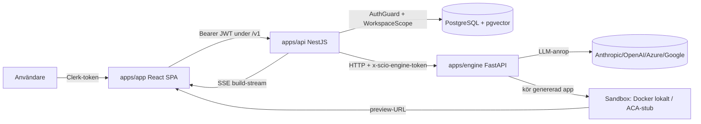

# Production Readiness Review

## 1. Dokumentinformation

| Fält | Värde |
|---|---|
| Datum | 2026-08-24 |
| Repository | Scio — AI app builder (monorepo: `apps/api`, `apps/engine`, `apps/app`, `packages/shared`) |
| Granskad branch/commit | **Kunde inte verifieras** — `git` finns inte i granskningsmiljöns PATH (kommandot `git rev-parse` gav exit 1). Granskningen avser arbetskopian i `c:\Robotics\Scio` per datumet ovan. |
| Omfattning | Hela systemet: backend, engine, frontend, delat kontrakt, datamodell + 12 migreringar, CI, container/dev-konfiguration, scripts, dokumentation. |
| Metod | Evidensbaserad statisk kodläsning. Varje fynd är verifierat mot faktiska filer; fil- och radhänvisningar anges. Där en radhänvisning är ungefärlig anges "~". |
| Prioriteringsmodell | P0–P3 + INFO, med sannolikhet/konsekvens/säkerhet i bedömningen/insats per fynd. |

### Begränsningar

- **Baslinjekontroller kunde inte köras.** Miljön saknar `pnpm`, installerade `node_modules`, Python-`venv` och `git` (verifierat: `node -v` → v23.9.0, men `pnpm -v` och `git` saknas; `node_modules`/`.venv` saknas). Ingen build/lint/typkontroll/test har exekverats. Alla testpåståenden bygger på läsning av testkällkod och `README.md`, inte på körning.
- **`.env.example` kunde inte läsas.** `apps/api/.env.example`, `apps/engine/.env.example`, `apps/app/.env.example` är blockerade av verktygskonfiguration. Slutsatser om miljövariabler bygger på hur de läses i koden.
- **Sårbarhets- och licensdata kräver extern verifiering** (ingen internetåtkomst för CVE/licensuppslag).
- **Ingen tjänst startades**, inga externa anrop, inga riktiga credentials.
- Rapporten påstår inte att något är säkert enbart för att en sårbarhet inte hittades statiskt.

---

## 2. Executive summary

**Vad systemet gör.** Scio är en webbaserad AI-appbyggare (positionerad mot Lovable). Användaren beskriver en app i en guide, får en fryst specifikation + kostnadsuppskattning, kan forma designen genom att markera en körande preview, och får en Next.js-app byggd paket-för-paket bakom riktiga kvalitetsgrindar. `README.md` (rad 1–13) uppger ~26k rader kod och testantal engine 590 / api 104 / app 76. Systemet är multi-tenant med per-workspace-isolering och kostnadsmätning.

**Övergripande teknisk kvalitet.** Ovanligt hög för stadiet. Genomgående "fail-closed"-design (tenant-scoping, dev-auth, sandbox-val, engine-token, kostnadstak), väl normaliserad datamodell med databas-enforcerade invarianter (partiella unika index), och genuina laddnings-/fel-/tomtillstånd i frontend. Koden är rikligt kommenterad med *varför*.

**Viktigaste styrkorna.**
1. Central tenant-isolering som failar stängt på okända operationer ([apps/api/src/auth/workspace-scope.ts](apps/api/src/auth/workspace-scope.ts#L62-L84)).
2. Kostnadskontroll i två lager + mätning även av avbrutna/kraschade byggen ([apps/api/src/modules/build/build.service.ts](apps/api/src/modules/build/build.service.ts), [apps/api/src/modules/usage/usage.service.ts](apps/api/src/modules/usage/usage.service.ts)).
3. Databas-enforcerade invarianter: "exakt en current-version" via partiellt unikt index, FK-index, idempotens-index ([apps/api/prisma/migrations/0006_indexes_and_one_current/migration.sql](apps/api/prisma/migrations/0006_indexes_and_one_current/migration.sql), [0010_build_idempotency/migration.sql](apps/api/prisma/migrations/0010_build_idempotency/migration.sql)).

**Viktigaste riskerna.**
1. **Ingen driftsättning finns** (bara `docker-compose.yml` med enbart `db`, plus en devcontainer). Systemet kan inte nås av externa användare.
2. **Produktionsisoleringen av sandboxen är inte byggd** — ACA-vägen (ADR-0005) är en stub som kastar `SandboxError`; kvarvarande isolerande väg är Docker på delad värd *utan nätverkspolicy*, och untrusted LLM-genererad kod körs.
3. **Observability + graceful shutdown saknas i praktiken** — inga metrics/tracing/correlation-id, och den avsedda graceful shutdown (Prisma `$disconnect`) är inte inkopplad eftersom `enableShutdownHooks()` aldrig anropas.

**Antal fynd per prioritet.** P0: 0 · P1: 4 · P2: 9 · P3: 4 · INFO: se avsnitt 6.

**Produktionsberedskap:** se avsnitt 3. **Rekommenderat beslut:** **NO-GO** för publik produktion; **CONDITIONAL GO** för den stängda interna alfa som projektets roadmap siktar på ([docs/ROADMAP.md](docs/ROADMAP.md), Phase 7).

---

## 3. Produktionsbedömning

### Bedömning: **NOT READY** (för publik produktion)

- **Ingen driftsättningsväg.** Endast [docker-compose.yml](docker-compose.yml) (bara `db`, `pgvector/pgvector:pg16`) och `.devcontainer/Dockerfile`. Inga runtime-images, ingen IaC. `README.md` och `docs/ROADMAP.md` (Phase 7) säger själva att alfan är blockerad på B079 ("nobody outside the sandbox can open it").
- **Produktions-sandbox saknas.** [apps/engine/src/scio_engine/core/aca_sandbox.py](apps/engine/src/scio_engine/core/aca_sandbox.py#L64-L81) är en stub; [core/sandbox.py](apps/engine/src/scio_engine/core/sandbox.py#L235-L260) noterar själv att Docker-vägen saknar nätverkspolicy.
- **Observability saknas**; graceful shutdown är inte inkopplad (F-03, F-06).
- **Inga supply-chain-/säkerhetskontroller i CI** ([.github/workflows/ci.yml](.github/workflows/ci.yml)).

För den avgränsade **stängda alfan** (interna testare, ingen publik trafik, inga personuppgifter i volym) är systemet nära, men fortfarande beroende av en driftsättningsväg och en isolerande sandbox. Se avsnitt 17.

---

## 4. Systemöversikt

**Syfte.** Generera, köra, granska och leverera fungerande appar från naturlig-språk-beskrivning, med ärlig statusrapportering och kostnadskontroll.

**Användarroller.** `owner` / `member` inom en `Workspace` ([apps/api/prisma/schema.prisma](apps/api/prisma/schema.prisma), enum `UserRole`). MVP: ett workspace per användare, auto-skapat vid första inloggning ([apps/api/src/auth/provisioning.service.ts](apps/api/src/auth/provisioning.service.ts#L26-L40)).

**Objektlivscykel.** Project → SpecVersion (fryst kontrakt) → DesignVersion → BuildJob (pågående försök) → BuildVersion (levererat, pekar på git-sha) → Deployment. Sidoobjekt: Message, ReferenceAsset/ReferenceEmbedding (pgvector), UsageEvent, Notification, AuditLog.

**Externa beroenden.** Clerk (auth, ADR-0008), LLM-leverantörer (Anthropic/OpenAI/Azure OpenAI/Google — [apps/engine/src/scio_engine/execution/provider.py](apps/engine/src/scio_engine/execution/provider.py)), PostgreSQL 16 + pgvector, Docker/ACA för sandbox.

**Kritiskt byggflöde.** Klient → `AuthGuard` verifierar token + provisionerar → `BuildService` öppnar `BuildJob`-rad *före* arbetet → relayar engine-SSE till webbläsaren → mäter spend per part → persisterar `BuildVersion` först när engine rapporterar en git-sha.

---

## 5. Teknisk inventering

| Komponent | Teknik | Ansvar | Sökväg | Kommentar |
|---|---|---|---|---|
| Backend-API | NestJS 10, TypeScript, Prisma 5 | Produktyta, auth, tenant-scoping, orkestrering, SSE-relay, mätning | `apps/api` | Versionerad `/v1`, Swagger på `/docs` ([main.ts](apps/api/src/main.ts#L31-L46)) |
| Engine | Python 3.11, FastAPI, uvicorn | Kodgenerering (Layer A→B→C), kritik/grindar, sandbox, estimat | `apps/engine` | Långlivad HTTP-tjänst, anropad av API |
| Frontend | React 18, Vite 5, Tailwind, react-router 6 | SPA: dashboard, wizard, spec, design, build, reveal, ship | `apps/app` | Clerk + SSE-konsument |
| Delat kontrakt | TypeScript | Typer delade api/app | `packages/shared` | `workspace:*` |
| Databas | PostgreSQL 16 + pgvector | Persistens, RAG-embeddings | `docker-compose.yml`, `apps/api/prisma` | 12 migreringar |
| Auth | Clerk + swappbar verifierare | Identitet | `apps/api/src/auth`, `apps/app/src/lib/auth.tsx` | Dev-auth för lokalt arbete |
| Sandbox | Docker (lokalt) / ACA dynamic sessions (avsedd) | Köra untrusted kod | `apps/engine/src/scio_engine/core/*sandbox.py` | ACA ej implementerad |
| Rate limiting | `@nestjs/throttler` | Per-workspace-tak | `apps/api/src/common/workspace-throttler.guard.ts` | 120 req/60 s |
| CI | GitHub Actions | Fresh-clone build/lint/test | `.github/workflows/ci.yml` | Ingen audit/SAST/secret-scan |
| Dev-orkestrering | Bash | Lokal helstack utan externa tjänster | `scripts/dev-up.sh`, `dev-down.sh` | Ingen produktions-deploy |

**Kan inte bedömas:** `.env.example`-innehåll (blockerat), CVE/licens (kräver internet), runtime-beteende (inga körningar), git-metadata (git saknas).

---

## 6. Positiva observationer (INFO)

- **Tenant-isolering, fail-closed.** `applyWorkspaceScope` stämplar/filtrerar `workspaceId` och **kastar** på okända operationer i stället för att släppa igenom dem oscopeade ([workspace-scope.ts](apps/api/src/auth/workspace-scope.ts#L62-L84)). `upsert`/`createMany` stängdes medvetet innan de fick en anropare.
- **404 i stället för 403 över tenants** för att undvika existensläckor ([project.service.ts](apps/api/src/modules/project/project.service.ts#L52-L58), [intake.service.ts](apps/api/src/modules/intake/intake.service.ts#L44-L49)).
- **Databas-enforcerade invarianter.** Partiellt unikt index "en current per project" för spec/build/design; FK-index (Prisma skapar dem inte på Postgres); partiellt idempotens-index ([migration 0006](apps/api/prisma/migrations/0006_indexes_and_one_current/migration.sql), [0010](apps/api/prisma/migrations/0010_build_idempotency/migration.sql)).
- **Kostnadskontroll i två lager + ärlig mätning.** Per-period-tak ([usage.service.ts](apps/api/src/modules/usage/usage.service.ts#L33-L88), default 50 USD) och per-build-tak via estimatets högtal × 1.5 ([build.service.ts](apps/api/src/modules/build/build.service.ts) `ceilingFor`). Avbrutna/kraschade byggen debiteras (`meterSpend`). Intake mäts som `kind: "intake"` ([intake.service.ts](apps/api/src/modules/intake/intake.service.ts#L244-L257)).
- **Durabla byggen.** `BuildJob` skapas före arbetet, heartbeat per event, reaping av döda jobb, idempotensnyckel som spelar upp i stället för att bygga om ([build.service.ts](apps/api/src/modules/build/build.service.ts)).
- **Engine-token med `compare_digest`** (timingsäker) och fail-closed i produktion ([apps/engine/src/scio_engine/main.py](apps/engine/src/scio_engine/main.py#L70-L124)).
- **Sandbox-härdning.** Env-allow-list så genererad kod inte ser plattformens nycklar ([sandbox.py](apps/engine/src/scio_engine/core/sandbox.py#L96-L112)), path-guard mot traversal ([L124-L133](apps/engine/src/scio_engine/core/sandbox.py#L124-L133)), egen Dockerfile framtvingad ("OURS, always"), CPU/minne/PID-limits ([L235-L260](apps/engine/src/scio_engine/core/sandbox.py#L235-L260)), fail-closed i produktion om ingen isolerande sandbox finns ([L393-L410](apps/engine/src/scio_engine/core/sandbox.py#L393-L410)).
- **Relay:** input+output-prissättning, timeout + bounded retry med backoff ([relay.py](apps/engine/src/scio_engine/execution/relay.py#L171-L220)).
- **Inputvalidering** med `class-validator` (t.ex. `MaxLength(4000)` på wizard-meddelanden — [intake.controller.ts](apps/api/src/modules/intake/intake.controller.ts#L16-L44)); global `ValidationPipe({ whitelist: true })` ([main.ts](apps/api/src/main.ts#L24)).
- **CORS allow-list, aldrig wildcard, tom default** ([main.ts](apps/api/src/main.ts#L11-L36)).
- **Fresh-clone-CI** utan cache för att fånga "it works here"-buggar ([.github/workflows/ci.yml](.github/workflows/ci.yml)).

---

## 7. Sammanställning av fynd

| ID | Prioritet | Kategori | Rubrik | Status | Blockerande | Insats |
|---|---|---|---|---|---|---|
| F-01 | P1 | Drift | Ingen driftsättning/IaC för api/engine/app | Verifierat | Ja | L |
| F-02 | P1 | Säkerhet | Produktions-sandbox (ACA) ej implementerad; ingen nätverkspolicy | Verifierat | Villkorligt | L |
| F-03 | P1 | Drift/Observability | Ingen metrics/tracing/correlation-id/larm | Verifierat | Villkorligt | M |
| F-04 | P1 | Supply chain | CI saknar audit/SAST/secret-scan; lock utan hashar | Verifierat | Villkorligt | S–M |
| F-05 | P2 | Drift/Korrekthet | `enableShutdownHooks()` saknas → ingen graceful shutdown | Verifierat | Nej | XS |
| F-06 | P2 | Konfiguration | API bootar utan `DATABASE_URL`; ingen fail-fast env-validering | Verifierat | Villkorligt | S |
| F-07 | P2 | Säkerhet | Clerk-webhook verifierar inte signatur (endast närvaro); ingen rawBody | Verifierat | Villkorligt | S |
| F-08 | P2 | Skalbarhet | Bygget körs inline i API-processens SSE, ingen worker/kö | Verifierat | Nej | L |
| F-09 | P2 | Korrekthet/Kostnad | Per-period-tak har TOCTOU-race + summeras i minnet | Verifierat | Nej | M |
| F-10 | P2 | Säkerhet (frontend) | Preview-iframes saknar `sandbox`-attribut | Verifierat | Villkorligt | S |
| F-11 | P2 | Säkerhet | API saknar säkerhetsheaders (helmet/CSP/HSTS); `/docs` öppen | Verifierat | Nej | S |
| F-12 | P2 | Data/Compliance | Ingen konto-/workspace-radering (FK RESTRICT); ingen retention | Verifierat | Villkorligt | M |
| F-13 | P2 | Funktion | Flera exponerade endpoints returnerar 501 (deployment/reference/workspace) | Verifierat | Nej | M |
| F-14 | P3 | Säkerhet | Prompt-injection: dokumenterade luckor (bild/Layer B/C ofenced) | Verifierat | Nej | M |
| F-15 | P3 | Korrekthet/Kostnad | Estimatets lågband medvetet optimistiskt | Verifierat | Nej | S |
| F-16 | P3 | Supply chain | Misstänkta paketnamn `httpcore2`/`httpx2` i lock | Öppen fråga | Nej | XS |
| F-17 | P3 | Frontend/UX + a11y | Ingen osparade-ändringar-guard; klickbara `div`-kort utan tangentbord | Verifierat | Nej | S |

Placeholder-*skärmar* (Settings/Versions/Notifications, website/automation, publicering) behandlas som saknad/ofullständig funktionalitet i avsnitt 9.

---

## 8. Detaljerade fynd

### [F-01] Ingen driftsättning eller IaC för applikationerna

| Fält | Bedömning |
|---|---|
| Prioritet | P1 · Kategori | Drift |
| Status | Verifierat problem |
| Sannolikhet | Hög · Konsekvens | Hög · Säkerhet i bedömningen | Hög · Insats | L |
| Produktionsblockerande | Ja |

**Evidens.** [docker-compose.yml](docker-compose.yml) innehåller endast `db` (rad 1–15). Enda Dockerfile är `.devcontainer/Dockerfile`. Ingen bicep/terraform/produktions-image funnen. [README.md](README.md#L7-L11) och [docs/ROADMAP.md](docs/ROADMAP.md) (Phase 7) bekräftar att plattformen under produkten inte är byggd (B079).

**Problem.** Ingen reproducerbar väg att bygga och köra `api`/`engine`/`app` som produktionsartefakter; ingen ingress, ingen miljöseparation utöver env.

**Produktionskonsekvens.** Systemet kan inte nås av externa användare och kan inte släppas eller rullas tillbaka deterministiskt.

**Realistiskt scenario.** En testare bjuds in men det finns ingen URL; en release kan inte genomföras.

**Grundorsak.** Projektet är i Phase 6→7; driftsättning är medvetet inte påbörjad.

**Rekommenderad åtgärd.** Produktions-Dockerfiles per app (multi-stage), IaC-baslinje för valt mål (ACA per ADR-0004/0005), release-pipeline som kör `prisma migrate deploy` före driftsättning.

**Verifiering.** Bygg images i CI, kör upp hela stacken i ren miljö, träffa `/health` + ett e2e-flöde.

**Beroenden/följdrisker.** Blockerar F-02, F-03 och migrering-vid-release.

---

### [F-02] Produktions-sandbox (ACA-isolering) ej implementerad; ingen nätverkspolicy

| Fält | Bedömning |
|---|---|
| Prioritet | P1 · Kategori | Säkerhet |
| Status | Verifierat problem |
| Sannolikhet | Medel · Konsekvens | Kritisk · Säkerhet i bedömningen | Hög · Insats | L |
| Produktionsblockerande | Villkorligt (Ja för publik drift) |

**Evidens.** [aca_sandbox.py](apps/engine/src/scio_engine/core/aca_sandbox.py#L1-L11) "⚠️ NOT RUN HERE"; `start`/`apply_change`/`stop` kastar `SandboxError(... is not implemented)` ([L64-L81](apps/engine/src/scio_engine/core/aca_sandbox.py#L64-L81)). [sandbox.py](apps/engine/src/scio_engine/core/sandbox.py#L141-L150): `LocalProcessSandbox` "is NOT an isolation boundary". [L235-L260](apps/engine/src/scio_engine/core/sandbox.py#L235-L260): Docker har mem/cpu/pids-limits men "Not a network policy … a real remaining gap (B118)". `choose_sandbox` failar stängt i produktion ([L393-L410](apps/engine/src/scio_engine/core/sandbox.py#L393-L410)).

**Problem.** Avsedd isolering (ADR-0005) är en stub. Kvarvarande isolerande väg är Docker på delad värd utan nätverksegress-policy. Genererad kod är per definition untrusted.

**Produktionskonsekvens.** Untrusted kod med nätverksåtkomst kan nå interna endpoints/molnmetadata (SSRF), exfiltrera data eller missbruka utgående nät; delad värd förstorar konsekvensen av en escape.

**Realistiskt scenario.** En genererad app (via injektion/hallucination) gör utgående anrop mot metadata-endpoint eller intern tjänst.

**Grundorsak.** Isoleringsmålet väntar på deploymentbeslutet (F-01).

**Rekommenderad åtgärd.** Implementera ACA-vägen (eller gVisor/container med nätverkspolicy) + default-deny egress. Behåll fail-closed-logiken och env-allow-listen.

**Verifiering.** Negativa nätverkstester (metadata/interna nät blockeras), escape-övning, verifiera att produktion vägrar starta utan isolerande sandbox.

**Beroenden/följdrisker.** Beror på F-01. Högsta säkerhetsprioritet före publik trafik.

---

### [F-03] Ingen observability: inga metrics, tracing, correlation-id eller larm

| Fält | Bedömning |
|---|---|
| Prioritet | P1 · Kategori | Drift/Observability |
| Status | Verifierat problem |
| Sannolikhet | Hög · Konsekvens | Hög · Säkerhet i bedömningen | Hög · Insats | M |
| Produktionsblockerande | Villkorligt |

**Evidens.** Enda health-ytan är [health.controller.ts](apps/api/src/health/health.controller.ts) (liveness + `SELECT 1`). Ingen readiness, inga metrics/tracing/correlation-id. Loggning via Nest `Logger` och Python `logging.basicConfig` ([main.py](apps/engine/src/scio_engine/main.py#L58-L66)) till stdout, utan korrelation mellan API- och engine-loggar.

**Problem.** Ett minuters-långt, pengaspenderande bygge som spänner API→engine→sandbox saknar spårbarhet; ingen larmning på fel/kostnad.

**Produktionskonsekvens.** Incidenter upptäcks sent; felsökning blir gissningar; kostnadsskenande kan pågå oupptäckt trots taket.

**Realistiskt scenario.** En engine-degradering ger tysta byggfel som märks först via användarklagomål.

**Grundorsak.** Observability planerat till Phase 7, ännu ej byggt.

**Rekommenderad åtgärd.** Correlation-id per request (propagerat i engine-anropen), strukturerad JSON-logg, readiness-endpoint (DB + engine), bas-metrics (byggutfall, kostnad/period, felkvot), larm.

**Verifiering.** Spåra ett e2e-bygge via correlation-id; utlös ett larm i test.

**Beroenden/följdrisker.** Bör landa med F-01.

---

### [F-04] CI saknar dependency-audit, SAST och secret-scanning; lock utan hashar

| Fält | Bedömning |
|---|---|
| Prioritet | P1 · Kategori | Supply chain |
| Status | Verifierat problem |
| Sannolikhet | Medel · Konsekvens | Hög · Säkerhet i bedömningen | Hög · Insats | S–M |
| Produktionsblockerande | Villkorligt |

**Evidens.** [.github/workflows/ci.yml](.github/workflows/ci.yml) kör install/build/lint/test men inget `pnpm/pip-audit`, CodeQL/Semgrep eller secret-scan (grep gav noll träffar). `apps/engine/requirements.lock` är pinnad via `pip freeze` men saknar `--hash`-poster.

**Problem.** Sårbara/manipulerade beroenden fångas inte automatiskt; hemligheter kan råka checkas in; artefaktintegritet är inte verifierad.

**Produktionskonsekvens.** Känd-sårbara paket kan nå produktion utan signal.

**Realistiskt scenario.** Ett paket får en CVE; utan audit upptäcks det inte förrän manuellt.

**Grundorsak.** Pipen är byggd för korrekthet, inte ännu för supply-chain-säkerhet.

**Rekommenderad åtgärd.** `pnpm audit` + `pip-audit` i CI (rapporterande → blockerande på hög/kritisk), secret-scan (gitleaks), gärna CodeQL; överväg hash-pinnad lock.

**Verifiering.** Introducera ett känt-sårbart paket i en testbranch och se att pipen flaggar.

**Beroenden/följdrisker.** Kan ge initialt brus som måste triageras.

---

### [F-05] `enableShutdownHooks()` saknas → Prisma stänger inte ner grasiöst

| Fält | Bedömning |
|---|---|
| Prioritet | P2 · Kategori | Drift/Korrekthet |
| Status | Verifierat problem |
| Sannolikhet | Hög · Konsekvens | Medel · Säkerhet i bedömningen | Hög · Insats | XS |
| Produktionsblockerande | Nej |

**Evidens.** [prisma.service.ts](apps/api/src/prisma/prisma.service.ts#L33-L40) implementerar `onModuleDestroy()` med `$disconnect()` och kommenterar att "On SIGTERM the pool used to drop mid-query". Men [main.ts](apps/api/src/main.ts#L22-L54) anropar aldrig `app.enableShutdownHooks()` — grep bekräftar noll förekomster i `apps/api/src`. I NestJS anropas `onModuleDestroy` vid process-signaler **endast** om shutdown-hooks är aktiverade.

**Problem.** Den avsedda graceful shutdown är inte inkopplad. Vid SIGTERM (deploy/skalning) stängs inte Prisma-poolen kontrollerat.

**Produktionskonsekvens.** Requests kan avbrytas mitt i, anslutningar läcka vid omstart/deploy — precis det kommentaren säger sig lösa.

**Realistiskt scenario.** En rullande deploy skickar SIGTERM; poolen stängs inte, pågående queries dör hårt.

**Grundorsak.** Bortglömt `enableShutdownHooks()` i bootstrap.

**Rekommenderad åtgärd.** Lägg `app.enableShutdownHooks()` i `bootstrap()` före `app.listen()`. En rad; ändrar inget kontrakt.

**Verifiering.** Skicka SIGTERM och verifiera att `onModuleDestroy`/`$disconnect` körs (logg) och att appen stänger rent.

**Beroenden/följdrisker.** Inga. Samspelar med F-08 (graceful shutdown av pågående byggen).

---

### [F-06] API bootar utan `DATABASE_URL`; ingen fail-fast konfigurationsvalidering

| Fält | Bedömning |
|---|---|
| Prioritet | P2 · Kategori | Konfiguration/Drift |
| Status | Verifierat problem |
| Sannolikhet | Medel · Konsekvens | Medel–Hög · Säkerhet i bedömningen | Hög · Insats | S |
| Produktionsblockerande | Villkorligt |

**Evidens.** [prisma.service.ts](apps/api/src/prisma/prisma.service.ts#L13-L31): `isConfigured` = `Boolean(process.env.DATABASE_URL)`; utan den loggas en varning och appen **fortsätter starta** utan databas, och `/health` rapporterar `db: "not_configured"` ([health.controller.ts](apps/api/src/health/health.controller.ts#L18-L25)). Ingen startvalidering av t.ex. `CLERK_SECRET_KEY` funnen i `bootstrap()` ([main.ts](apps/api/src/main.ts)). (Engine har däremot fail-closed på `SCIO_ENGINE_TOKEN` i produktion — [main.py](apps/engine/src/scio_engine/main.py#L70-L83).)

**Problem.** API:t kan starta "framgångsrikt" i en felkonfigurerad miljö och först vid första scoped-query fela. Health returnerar `status: "ok"` även utan DB.

**Produktionskonsekvens.** En deploy med saknad/felaktig `DATABASE_URL` blir grön i uppstart men trasig i drift; en naiv liveness-probe mot `/health` ser "ok".

**Realistiskt scenario.** Fel secret-referens i produktionsmiljön → appen startar, alla dataoperationer 500:ar, health döljer det.

**Grundorsak.** Medveten "boota utan DB"-design för lokalt bruk, utan miljöberoende fail-fast för produktion.

**Rekommenderad åtgärd.** Fail-fast i produktion (`SCIO_ENV=production`) om `DATABASE_URL`/`CLERK_SECRET_KEY` saknas, spegla engine-mönstret; låt readiness (F-03) spegla DB-status separat från liveness.

**Verifiering.** Starta i "production" utan `DATABASE_URL` → processen ska vägra starta.

**Beroenden/följdrisker.** Bör samordnas med readiness-endpoint (F-03).

---

### [F-07] Clerk-webhook verifierar inte signaturen (endast närvaro); ingen rawBody

| Fält | Bedömning |
|---|---|
| Prioritet | P2 (latent P1 när handlern får sidoeffekter) · Kategori | Säkerhet |
| Status | Verifierat problem |
| Sannolikhet | Låg idag → Hög när `user.deleted` implementeras · Konsekvens | Kritisk · Säkerhet i bedömningen | Hög · Insats | S |
| Produktionsblockerande | Villkorligt |

**Evidens.** [webhook.controller.ts](apps/api/src/auth/webhook.controller.ts#L37-L56): kontrollerar `secret && !signature` och kräver secret i produktion, men "TODO(3.3 follow-up): verify the svix signature itself, not merely its presence"; `user.deleted` är en TODO. Ingen `rawBody`-konfiguration i [main.ts](apps/api/src/main.ts) (svix behöver den råa kroppen).

**Problem.** Endast närvaron av `svix-signature` kontrolleras, inte att den är giltig. Handlern är inert idag, men koden inbjuder till att lägga sidoeffekter bakom en overifierad signatur.

**Produktionskonsekvens.** När radering/cleanup kopplas på kan en förfalskad webhook trigga kontomanipulation.

**Realistiskt scenario.** En utvecklare implementerar `user.deleted`-städning; angripare skickar förfalskade webhooks och avprovisionerar konton.

**Grundorsak.** Medvetet delimplementerat; refusal-ordningen finns men verifieringen är TODO.

**Rekommenderad åtgärd.** Verifiera svix-signaturen med `svix` mot `CLERK_WEBHOOK_SIGNING_SECRET` innan någon sidoeffekt tillåts; aktivera `rawBody` för endpointen.

**Verifiering.** Test med giltig/ogiltig signatur → 401 på ogiltig.

**Beroenden/följdrisker.** Måste vara på plats *före* F-12 (`user.deleted`-hantering).

---

### [F-08] Bygget körs inline i API-processens SSE-request, ingen worker/kö

| Fält | Bedömning |
|---|---|
| Prioritet | P2 · Kategori | Skalbarhet/Drift |
| Status | Verifierat problem |
| Sannolikhet | Medel · Konsekvens | Medel · Säkerhet i bedömningen | Hög · Insats | L |
| Produktionsblockerande | Nej |

**Evidens.** [build.service.ts](apps/api/src/modules/build/build.service.ts) `run()` relayar engine-strömmen direkt till HTTP-svaret (`emit`) och kommenterar själv att samma väg "later [could] be driven by a queue worker". Byggen kan ta upp till `BUILD_LOCK_MS = 90 min`.

**Problem.** Ett bygge lever i en enskild API-request. En deploy/omstart avbryter pågående byggen (mildrat av jobbrader + reaping, men bygget dör), och långlivade SSE binder API-arbetare → begränsar horisontell skalning och graceful shutdown.

**Produktionskonsekvens.** Sämre skalbarhet under samtidiga byggen; störande deploys; risk för resursutmattning.

**Realistiskt scenario.** Flera samtidiga byggen binder API-noden i minuter; en rullande deploy avbryter alla.

**Grundorsak.** Medveten enkelhet; kö/worker uppskjutet (ADR-0020 delvis realiserad i datamodellen).

**Rekommenderad åtgärd.** Flytta byggkörning till bakgrunds-worker/kö; klienten prenumererar på jobbets ström. `BuildJob` (heartbeat/last_event) stödjer redan detta.

**Verifiering.** Deploy under pågående bygge förlorar inte bygget; samtidiga byggen binder inte API-arbetare.

**Beroenden/följdrisker.** Kräver kö/broker; samspelar med F-01/F-03/F-05.

---

### [F-09] Per-period-kostnadstak har TOCTOU-race och summeras i minnet

| Fält | Bedömning |
|---|---|
| Prioritet | P2 · Kategori | Korrekthet/Kostnad |
| Status | Verifierat problem |
| Sannolikhet | Medel · Konsekvens | Medel · Säkerhet i bedömningen | Medel · Insats | M |
| Produktionsblockerande | Nej |

**Evidens.** [usage.service.ts](apps/api/src/modules/usage/usage.service.ts#L60-L88): `spentThisPeriod` hämtar **alla** periodrader och summerar i JS (`findMany(...).reduce`), inte DB-`aggregate`; `allowance` är ren läsning. [build.service.ts](apps/api/src/modules/build/build.service.ts) `ensureCanStart` anropar `allowance` och skapar därefter jobb utan att kontroll + jobbskapande är atomiskt.

**Problem.** (1) Två samtidiga byggen kan båda passera takkontrollen innan spend bokförs och tillsammans överskrida taket. (2) In-memory-summering växer linjärt med antal `UsageEvent`-rader.

**Produktionskonsekvens.** Taket kan överskridas under samtidighet (kostnadsläckage); kontrollen blir långsammare med mer historik.

**Realistiskt scenario.** Ett skript startar flera byggen inom samma sekund; alla ser `room=true`.

**Grundorsak.** Läs-och-summera utan atomicitet/aggregat.

**Rekommenderad åtgärd.** DB-`aggregate`/`sum` för perioden; gör takkontroll + jobbskapande atomiskt (transaktion/lås eller villkorad insert). Behåll per-build-taket.

**Verifiering.** Samtidighetstest: N parallella byggstarter över taket ska tillåta högst det som ryms.

**Beroenden/följdrisker.** Ingen API-ändring; intern transaktionslogik.

---

### [F-10] Preview-iframes saknar `sandbox`-attribut

| Fält | Bedömning |
|---|---|
| Prioritet | P2 · Kategori | Säkerhet (frontend) |
| Status | Verifierat problem |
| Sannolikhet | Medel · Konsekvens | Medel–Hög · Säkerhet i bedömningen | Medel · Insats | S |
| Produktionsblockerande | Villkorligt |

**Evidens.** [DesignPage.tsx](apps/app/src/pages/DesignPage.tsx#L635-L639) och [RevealPage.tsx](apps/app/src/pages/RevealPage.tsx#L154-L156) renderar den genererade appen i en `iframe` vars `src` = API:s `previewUrl`, utan `sandbox`-attribut. Bridge-origin pinnas dock ([bridge.ts](apps/app/src/lib/bridge.ts#L99-L110)). Ingen `dangerouslySetInnerHTML` i appen.

**Problem.** Untrusted genererad kod körs i iframe utan `sandbox`-restriktioner; skyddet vilar helt på origin-separation som backend kontrollerar.

**Produktionskonsekvens.** Om preview-origin sammanfaller med produktens origin kan den framade appen köra skript/navigera top-fönstret/nå parent.

**Realistiskt scenario.** Genererad app försöker `top.location`-navigera — utan `sandbox` färre spärrar.

**Grundorsak.** Isolering tänkt via origin; `sandbox`-attributet som djupförsvar saknas.

**Rekommenderad åtgärd.** `sandbox="allow-scripts"` (utan `allow-same-origin` mot produktens origin) på preview-iframes; servera previews från separat isolerat origin; sätt CSP `frame-src`.

**Verifiering.** Top-navigering/parent-åtkomst från genererad app ska blockeras.

**Beroenden/följdrisker.** Kopplar till F-01/F-02 (preview-origin).

---

### [F-11] API saknar säkerhetsheaders; Swagger `/docs` oskyddad

| Fält | Bedömning |
|---|---|
| Prioritet | P2 · Kategori | Säkerhet |
| Status | Verifierat problem |
| Sannolikhet | Medel · Konsekvens | Medel · Säkerhet i bedömningen | Hög · Insats | S |
| Produktionsblockerande | Nej |

**Evidens.** [main.ts](apps/api/src/main.ts#L22-L54) sätter prefix, ValidationPipe och CORS men ingen `helmet()`; grep efter `helmet|contentSecurityPolicy|hsts` i `apps/api` gav noll. Swagger sätts upp ovillkorligt på `/docs` ([main.ts](apps/api/src/main.ts#L38-L46)) utan produktionsvillkor.

**Problem.** Svar saknar HSTS/`X-Content-Type-Options`/`X-Frame-Options`/CSP; API-kontraktet exponeras på `/docs` i alla miljöer.

**Produktionskonsekvens.** Svagare djupförsvar mot clickjacking/MIME-sniffing; onödig informationsexponering via `/docs`.

**Realistiskt scenario.** `/docs` publikt tillgängligt i produktion.

**Grundorsak.** Headers/villkorlig Swagger inte tillagda ännu.

**Rekommenderad åtgärd.** `helmet` i `main.ts`; villkora/skydda `/docs` i produktion.

**Verifiering.** Kontrollera svarsheaders; `/docs` ej öppet i produktion.

**Beroenden/följdrisker.** Säkerställ att CSP inte bryter preview-bridgen.

---

### [F-12] Ingen konto-/workspace-radering (FK RESTRICT); ingen retention

| Fält | Bedömning |
|---|---|
| Prioritet | P2 · Kategori | Data/Compliance |
| Status | Verifierat problem |
| Sannolikhet | Hög (publik drift m. personuppgifter) · Konsekvens | Hög · Säkerhet i bedömningen | Medel · Insats | M |
| Produktionsblockerande | Villkorligt |

**Evidens.** [webhook.controller.ts](apps/api/src/auth/webhook.controller.ts#L55): `user.deleted` är TODO. `Project` har soft-delete (`deletedAt`) men [project.service.ts](apps/api/src/modules/project/project.service.ts#L82-L118) behåller medvetet `usage_event` och det finns ingen radering av `User`/`Workspace`. FK:er är `ON DELETE RESTRICT` ([migration 0001](apps/api/prisma/migrations/0001_init/migration.sql#L217-L226)), så en hård radering av workspace/projekt skulle blockeras utan explicit kaskad. `User.email` lagrar personuppgift ([schema.prisma](apps/api/prisma/schema.prisma)). ADR-0019 (deletion & retention) är "Proposed".

**Problem.** Ingen genomförd väg för konto-/workspace-radering eller retention/"right to be forgotten"; datamodellens RESTRICT gör det dessutom icke-trivialt utan en medveten kaskadordning.

**Produktionskonsekvens.** Vid publik drift saknas laglig raderingsförmåga; data ackumuleras utan policy.

**Realistiskt scenario.** En användare begär radering; systemet kan inte fullt ut radera identitet/projekt/mätdata.

**Grundorsak.** Beslutet (ADR-0019) är inte fastställt/implementerat.

**Rekommenderad åtgärd.** Fastställ ADR-0019; implementera kaskad-radering/anonymisering (respektera RESTRICT-ordningen) + retentionspolicy. Koppla till signaturverifierad webhook (F-07).

**Verifiering.** Radera ett testkonto och verifiera hantering av identitet/projekt/mätdata enligt policy.

**Beroenden/följdrisker.** Kräver produkt-/juridikbeslut; beror på F-07.

---

### [F-13] Flera exponerade endpoints returnerar 501 (deployment/reference/workspace)

| Fält | Bedömning |
|---|---|
| Prioritet | P2 · Kategori | Funktion |
| Status | Verifierat problem |
| Sannolikhet | Medel · Konsekvens | Medel · Säkerhet i bedömningen | Hög · Insats | M |
| Produktionsblockerande | Nej |

**Evidens.** Wired routes som kastar `NotImplementedException`:
- [deployment.service.ts](apps/api/src/modules/deployment/deployment.service.ts#L15-L21) `list`/`create` — "phase 8".
- [reference.service.ts](apps/api/src/modules/reference/reference.service.ts#L20-L30) `list`/`create` — "phase 4.6" (använder dessutom rå `PrismaService`, inte `WorkspaceScope` — ofarligt idag eftersom den kastar före query, men fel mönster att ärva).
- [workspace.service.ts](apps/api/src/modules/workspace/workspace.service.ts#L9-L11) `current` — "phase 3.4".
Dessutom är [stream.controller.ts](apps/api/src/modules/stream/stream.controller.ts#L18-L27) en stub som endast sänder heartbeats **och saknar workspace-scoping** (ingen `@CurrentWorkspace`/ägarkontroll på `projectId` — låg risk idag eftersom den bara ekar tillbaka `projectId`).

**Problem.** Ytor exponeras i API/Swagger men saknar implementation; en av dem har ett scoping-mönster som inte får kopieras.

**Produktionskonsekvens.** Klienter som råkar anropa dem får 501; publicering (deployment) och referens-/RAG-uppladdning finns inte trots att kontrakt/route antyder dem.

**Realistiskt scenario.** En framtida frontend-koppling mot references/deployment ger 501 i produktion.

**Grundorsak.** Skelett byggt före implementation, exponerat i förväg.

**Rekommenderad åtgärd.** Antingen implementera bakom feature-flagga eller ta bort route tills de byggs; när `reference` implementeras, använd `WorkspaceScope` och lägg ägarkontroll i `stream`.

**Verifiering.** Rutt-tester som säkerställer korrekt status och scoping.

**Beroenden/följdrisker.** `deployment` beror på F-01 (publiceringsmål).

---

### [F-14] Prompt-injection: dokumenterade kvarvarande luckor

| Fält | Bedömning |
|---|---|
| Prioritet | P3 · Kategori | Säkerhet |
| Status | Verifierat problem (självdeklarerat) |
| Sannolikhet | Medel · Konsekvens | Medel · Säkerhet i bedömningen | Medel · Insats | M |
| Produktionsblockerande | Nej |

**Evidens.** [docs/SECURITY.md](docs/SECURITY.md) (B104): skärmdumpar/text-i-bild fenchas inte; Layer B/C tar emot spec-fältvärden ofenced; katalogposter bär text mellan tenants (bounded). Fencing/struktur/grindar finns ([execution/untrusted.py](apps/engine/src/scio_engine/execution/untrusted.py), [builder/critique.py](apps/engine/src/scio_engine/builder/critique.py)). Inget test bevisar att en riktig modell motstår en riktig injektion.

**Problem.** Restrisker är kända men inte stängda; starkaste skyddet (deterministiska grindar) står kvar, svagare lager har luckor.

**Produktionskonsekvens.** I värsta fall oärlig "honest status" (kärnlöftet) eller sämre komponentval; inte privilegie-eskalering (blast radius begränsad av env-allow-list).

**Realistiskt scenario.** Text i en bild i den körande appen påverkar kritiken via skärmdumpsvägen.

**Grundorsak.** Första passet över injektionsytan; bild-/Layer-B/C-vägar återstår.

**Rekommenderad åtgärd.** Fencing även för Layer B/C-värden; behandla OCR/bildtext som untrusted; överväg ett mätt injektionsprov (kräver nycklar).

**Verifiering.** Utöka `test_prompt_injection.py` med bild-/Layer-B/C-fall.

**Beroenden/följdrisker.** Experiment kräver nycklar/kostnad.

---

### [F-15] Estimatets lågband underskattar medvetet den verkliga kostnaden

| Fält | Bedömning |
|---|---|
| Prioritet | P3 · Kategori | Korrekthet/Kostnad |
| Status | Verifierat problem (självdeklarerat) |
| Sannolikhet | Hög · Konsekvens | Låg–Medel · Säkerhet i bedömningen | Hög · Insats | S |
| Produktionsblockerande | Nej |

**Evidens.** [estimate.py](apps/engine/src/scio_engine/estimate.py) kommenterar att estimatet "under-predicts the point cost, and knowingly", och att konstanterna är kalibrerade mot en äldre output-only-prismodell medan relayn nu prissätter input+output ([relay.py](apps/engine/src/scio_engine/execution/relay.py#L171-L186)). Kopplat till B115.

**Problem.** Lågbandet är optimistiskt mot faktisk prissättning.

**Produktionskonsekvens.** Acceptabelt som intervall-UI, men riskabelt om lågbandet används som hård godkännandetröskel.

**Realistiskt scenario.** Användare godkänner mot lågbandet och överraskas av utfall nära högbandet.

**Grundorsak.** Kalibrering mot tidigare prismodell; väntar på mätkörning (B115).

**Rekommenderad åtgärd.** Omkalibrera mot riktiga körningar; visa tydligt att det är ett intervall (per-build-taket är redan kopplat till högbandet via `ceilingFor`).

**Verifiering.** Jämför estimat mot uppmätt spend över flera byggen.

**Beroenden/följdrisker.** Kräver nycklar/kostnad.

---

### [F-16] Misstänkta paketnamn `httpcore2`/`httpx2` i `requirements.lock`

| Fält | Bedömning |
|---|---|
| Prioritet | P3 · Kategori | Supply chain |
| Status | Öppen fråga (kräver extern verifiering) |
| Sannolikhet | Låg · Konsekvens | Hög (om typosquat) · Säkerhet i bedömningen | Låg · Insats | XS |
| Produktionsblockerande | Nej |

**Evidens.** `apps/engine/requirements.lock` innehåller enligt tidigare läsning både `httpcore`/`httpx` och `httpcore2`/`httpx2`. Provenance kunde inte verifieras (ingen internetåtkomst). *Denna post bör bekräftas manuellt mot filen och PyPI.*

**Problem.** Ovanliga namn bredvid de kända kan vara legitima eller en risk; går inte att avgöra statiskt utan uppslag.

**Produktionskonsekvens.** Om oavsiktligt/typosquat kan skadlig kod introduceras.

**Grundorsak.** Okänd; kräver kontroll av hur låset genererades.

**Rekommenderad åtgärd.** Verifiera mot PyPI (provenance/maintainer) och `pyproject.toml`; ta bort om onödiga; inför hash-pinning (F-04).

**Verifiering.** `pip-audit` + manuell provenance-kontroll.

**Beroenden/följdrisker.** Del av F-04.

---

### [F-17] Ingen osparade-ändringar-guard; klickbara `div`-kort utan tangentbord

| Fält | Bedömning |
|---|---|
| Prioritet | P3 · Kategori | Frontend/UX + Tillgänglighet |
| Status | Verifierat problem |
| Sannolikhet | Medel · Konsekvens | Låg · Säkerhet i bedömningen | Medel · Insats | S |
| Produktionsblockerande | Nej |

**Evidens.** [DesignPage.tsx](apps/app/src/pages/DesignPage.tsx) har föränderligt pending/prompt-tillstånd men tillåter direkt navigering vidare utan bekräftelse; ingen `beforeunload`/route-guard funnen. [CreatePage.tsx](apps/app/src/pages/CreatePage.tsx#L22-L31): typväljaren är en `div` med `onClick` utan `role="button"`/`tabIndex`/tangenthantering (övrig app har god a11y — landmarks, `focus-visible`, `role="status"`/`aria-live`).

**Problem.** Påbörjade designändringar kan tappas vid navigering; ett centralt val i skapa-flödet är inte tangentbords-/skärmläsarnåbart.

**Produktionskonsekvens.** Förlorat användararbete; tangentbordsanvändare kan inte välja projekttyp.

**Rekommenderad åtgärd.** Route-/`beforeunload`-guard vid opersisterade markningar; gör korten till `button` (eller `role`/`tabIndex`/`onKeyDown`).

**Verifiering.** Navigera bort med pending-ändringar → prompt; tabba + Enter/Space på korten; axe-genomgång.

**Beroenden/följdrisker.** Inga.

---

## 9. Saknad eller ofullständig funktionalitet

**Verifierat saknad funktionalitet.**
- **Driftsättning/hosting** — inga produktions-images/IaC (F-01; B079).
- **Produktions-sandboxisolering (ACA)** — stub som kastar `SandboxError` (F-02).
- **Konto-/workspace-radering & retention** — TODO + FK RESTRICT (F-12; ADR-0019 "Proposed").
- **Observability** — inga metrics/tracing/larm (F-03).
- **Publicering (deployment)** — `NotImplementedException` "phase 8" (F-13); UI säger "Not built yet" ([ShipPage.tsx](apps/app/src/pages/ShipPage.tsx#L106), [RevealPage.tsx](apps/app/src/pages/RevealPage.tsx#L222)).
- **Referens-/RAG-uppladdning** — `NotImplementedException` "phase 4.6" (F-13).

**Ofullständig implementation.**
- **workspace.current** stub "phase 3.4" ([workspace.service.ts](apps/api/src/modules/workspace/workspace.service.ts#L9-L11)).
- **stream** endast heartbeats + osaknad scoping ([stream.controller.ts](apps/api/src/modules/stream/stream.controller.ts)).
- **Settings / Versions / Notifications** — `PlaceholderPage` ([apps/app/src/App.tsx](apps/app/src/App.tsx#L18-L21), [PlaceholderPage.tsx](apps/app/src/pages/PlaceholderPage.tsx)). (Versionsfunktion finns dock i DesignPage-panelen.)
- **Projekttyper website/automation** — "Soon"/disabled ([CreatePage.tsx](apps/app/src/pages/CreatePage.tsx#L35)).
- **Clerk-webhook** — signaturverifiering + `user.deleted` är TODO (F-07/F-12).

**Motsägelser dokumentation ↔ implementation.** Ingen skarp motsägelse. Dokumentationen (README/roadmap/ADR/SECURITY) beskriver öppet vad som saknas och koden markerar sina egna luckor; ROADMAP är uttryckligen korrigerad (2026-08-22). Detta stärker förtroendet för dokumentationen.

**Produktfrågor som kräver beslut (öppna).** ADR-0018 (vad Ship/Refine/Settings är), ADR-0019 (radering/retention), ADR-0020 (byggen som jobb/kö — delvis realiserad; jfr F-08), prissättning/planer (B063; taket använder env-default 50 USD).

**Kunde inte verifieras.** Faktiskt runtime-beteende mot riktiga modeller; `.env.example`-innehåll; `httpcore2`/`httpx2`-provenance (F-16).

---

## 10. Test- och kvalitetsbedömning

**Befintliga testnivåer (via testkällkod + [README.md](README.md#L7-L11): engine 590, api 104, app 76).**
- **Engine (pytest):** deterministiska enhetstester med fake-providers för relay, estimat, env-laddning, prompt-injection, sandbox-konformitet. Live/browser-tester skip-gatade.
- **API (vitest):** bl.a. ett test som failar sviten om en service når den oscopeade Prisma-klienten (tenant-scoping-fence).
- **Frontend (vitest + testing-library):** god täckning av wizard/spec/correction, design/build/reveal/ship, projektresume, API-klient.

**Kritiska flöden MED testskydd:** intake→spec→grind, design/build/reveal, tenant-scoping, relay/estimat, injektionens strukturella regler.

**Kritiska flöden UTAN tillräckligt testskydd:**
- Samtidighet kring kostnadstaket (F-09).
- Verklig sandbox-isolering/nätverksegress (F-02) — endast kontraktstester.
- Webhook-signaturverifiering (F-07) — inget att testa ännu.
- Graceful shutdown (F-05) — ingen test på SIGTERM-beteende.
- Konfigurationsvalidering (F-06).

**Resultat från körda kontroller:** *Inga kontroller kördes* (avsnitt 1/18) — miljön saknar `pnpm`/`node_modules`/`.venv`/`git`. Bedömningen bygger på testkällkod.

**Regressionsrisk.** Måttlig och väl hanterad (fresh-clone-CI + determinism). Störst i de oskyddade områdena ovan.

**Rekommenderade kompletterande tester:** samtidighetstest (tak), negativa nätverkstester (sandbox), signaturtester (webhook), SIGTERM-test (shutdown), e2e i CI mot uppstartad stack när driftsättning finns.

---

## 11. Säkerhets- och integritetsbedömning

**Attackyta.** Publikt: `apps/app` (SPA), `apps/api` (`/v1`, `/docs`, `/health`, Clerk-webhook). Internt: engine (HTTP, delad hemlighet), sandbox (kör untrusted kod), LLM-leverantörer, PostgreSQL.

**AuthN/AuthZ.** Global `AuthGuard` (`APP_GUARD`) kräver bearer-token på allt utom `@Public()` ([auth.module.ts](apps/api/src/modules/auth/auth.module.ts), [auth.guard.ts](apps/api/src/auth/auth.guard.ts)). Tenant-auktorisering enforceras i data-lagret via `WorkspaceScope` (fail-closed), objektåtkomst via scopad klient. Öppen fråga: `owner`/`member` verkar ännu inte differentiera behörigheter (MVP en användare/workspace) — verifiera innan team-funktioner.

**Dataskydd.** Personuppgift: `User.email`. Ingen radering/retention (F-12). Loggning loggar id:n/belopp, inte hemligheter (stickprov i `build.service.ts`, `dev-identity-verifier.ts`); inga tokens/lösenord loggades i granskad kod.

**Secrets.** Miljöbaserade (Clerk, `SCIO_ENGINE_TOKEN`, LLM-nycklar via [config.py](apps/engine/src/scio_engine/config.py)). Inga hårdkodade hemligheter funna. Frontend använder endast Clerk **publishable** key. Engine-token jämförs timingsäkert (`compare_digest`). `.env`-loader låter miljön vinna över fil ([config.py](apps/engine/src/scio_engine/config.py#L40-L70)).

**Injektion/rendering.** Prisma parametriserar; subprocess-anrop använder argumentlistor (ingen `shell=True` funnen); genererad kod fenchas (restrisker i F-14). Preview-iframes saknar `sandbox` (F-10). `postMessage`-origin pinnas.

**SSRF.** Engine gör interna `urlopen`-anrop härledda från lokal preview-handle; huvudsaklig SSRF-risk kommer från sandboxens nätverksåtkomst (F-02).

**Rate limiting/missbruk.** Per-workspace-throttler (120/60 s) + kostnadstak. Styrka.

**Dependency-risker.** Pinnade lås utan audit/hash (F-04) + öppen provenance-fråga (F-16). **Kräver extern verifiering** (CVE/licens).

---

## 12. Drift- och deploymentbedömning

- **CI/CD.** Stark CI för korrekthet (fresh clone, frozen lockfile, engine från pinnat lås). Ingen CD/deploy-pipeline, ingen audit/SAST (F-04).
- **Konfiguration.** Miljödriven med goda guardrails (CORS/engine-token/dev-auth). Men API:t har ingen fail-fast på `DATABASE_URL`/`CLERK_SECRET_KEY` (F-06).
- **Deployment/migrering/rollback.** 12 Prisma-migreringar + `prisma migrate deploy`-script ([apps/api/package.json](apps/api/package.json)). Ingen release-orkestrering (F-01). Icke-destruktiv rollback på produktnivå (BuildVersion-historik).
- **Observability.** Endast liveness/DB-health; ingen readiness/metrics/tracing/larm (F-03).
- **Graceful shutdown.** Avsedd i Prisma men ej inkopplad (F-05). Engine stänger previews vid lifespan-avslut ([main.py](apps/engine/src/scio_engine/main.py#L85-L92)).
- **Backup/restore/DR.** DB som lokal docker-volym; ingen produktions-backup/DR dokumenterad. **Kunde inte verifieras** — behandlas som saknad.
- **Skalbarhet/tillförlitlighet.** Inline-byggen (F-08); jobbrader + heartbeat + reaping ger partiell återhämtning.

---

## 13. Riskmatris

| Riskområde | Sannolikhet | Konsekvens | Risknivå | Viktigaste fynd |
|---|---|---|---|---|
| Driftsättning saknas | Hög | Hög | **Kritisk** | F-01 |
| Sandbox-isolering (untrusted kod) | Medel | Kritisk | **Hög** | F-02 |
| Observability/incidenthantering | Hög | Hög | **Hög** | F-03 |
| Supply chain (audit/hash saknas) | Medel | Hög | **Hög** | F-04, F-16 |
| GDPR-radering/retention | Hög (publik) | Hög | **Hög** | F-12 |
| Kontomanipulation via webhook | Låg→Hög | Kritisk | **Medel→Hög** | F-07 |
| Felkonfig döljs vid start | Medel | Medel–Hög | **Medel** | F-06 |
| Kostnadsläckage under samtidighet | Medel | Medel | **Medel** | F-09 |
| Deploy/omstart avbryter byggen | Medel | Medel | **Medel** | F-05, F-08 |
| Frontend preview-isolering | Medel | Medel–Hög | **Medel** | F-10 |
| Prompt-injection restrisk | Medel | Medel | **Medel** | F-14 |
| Estimat optimistiskt | Hög | Låg–Medel | **Låg–Medel** | F-15 |

---

## 14. Prioriterad åtgärdsplan

### Före produktion (blockerande + P1)

| Åtgärd | Fynd | Riskreduktion | Insats | Beroenden | Ordning |
|---|---|---|---|---|---|
| Produktions-images + IaC + release/rollback med migrering | F-01 | Mycket hög | L | — | 1 |
| Isolerande sandbox (ACA/gVisor) + default-deny egress | F-02 | Mycket hög | L | F-01 | 2 |
| Observability: correlation-id, strukturerad logg, readiness, metrics, larm | F-03 | Hög | M | F-01 | 3 |
| Audit/SAST/secret-scan i CI; verifiera F-16; hash-pinning | F-04, F-16 | Hög | S–M | — | 2 (parallellt) |

### Inom 30 dagar (P2)

| Åtgärd | Fynd | Riskreduktion | Insats | Beroenden | Ordning |
|---|---|---|---|---|---|
| `app.enableShutdownHooks()` | F-05 | Medel | XS | — | 4 |
| Fail-fast env-validering i produktion | F-06 | Medel–Hög | S | — | 4 |
| Verifiera svix-signatur + rawBody | F-07 | Hög (latent) | S | — | 4 |
| Atomiskt kostnadstak + DB-aggregat | F-09 | Medel | M | — | 5 |
| `sandbox`-attribut + separat preview-origin + CSP | F-10 | Medel–Hög | S | F-01/F-02 | 5 |
| `helmet` + villkorad `/docs` | F-11 | Medel | S | — | 5 |
| Fastställ ADR-0019 + radering/retention | F-12 | Hög | M | F-07 | 6 |
| Städa 501-endpoints (flagga/ta bort) + scoping | F-13 | Låg–Medel | M | — | 6 |
| Worker/kö för byggen + graceful shutdown | F-08 | Medel–Hög | L | F-01 | 6 |

### Inom 90 dagar (P3 + långsiktigt)

| Åtgärd | Fynd | Riskreduktion | Insats | Beroenden | Ordning |
|---|---|---|---|---|---|
| Stäng prompt-injection-luckor + mätt experiment | F-14 | Medel | M | nycklar | 7 |
| Omkalibrera estimat (B115) | F-15 | Låg–Medel | S | nycklar | 7 |
| Osparade-ändringar-guard + knapp-semantik | F-17 | Låg | S | — | 7 |
| Bygg ut Settings/Versions/Notifications (ADR-0018) | Avsnitt 9 | Produkt | M–L | ADR-0018 | 8 |

---

## 15. Produktionschecklista

- `[x]` **Build** — CI bygger hela stacken från ren klon ([ci.yml](.github/workflows/ci.yml)). (Ej körd i denna granskning.)
- `[x]` **Tester** — enhets-/flödestester för api/engine/app körs i CI (engine 590/api 104/app 76 enligt README).
- `[?]` **Säkerhet** — stark tenant-isolering + rate limiting; men sandbox-isolering (F-02), headers (F-11) och webhook-signatur (F-07) återstår.
- `[x]` **Secrets** — miljöbaserade, inga hårdkodade; frontend endast publishable key; engine-token timingsäker.
- `[ ]` **Konfiguration** — ingen fail-fast på `DATABASE_URL`/`CLERK_SECRET_KEY` i API (F-06); `.env.example` ej läsbar.
- `[x]` **Datamigrering** — 12 Prisma-migreringar + `migrate deploy`-script.
- `[ ]` **Backup & restore** — ingen produktionsstrategi (endast lokal docker-volym).
- `[x]` **Rollback (produktnivå)** — icke-destruktiv version-rollback. `[ ]` **Deploy-rollback** — ingen release-pipeline (F-01).
- `[?]` **Health checks** — liveness + DB finns; readiness saknas (F-03). `/health` kan rapportera "ok" utan DB (F-06).
- `[x]` **Loggning** — finns; `[ ]` correlation-id/central logg saknas (F-03).
- `[ ]` **Metrics & larm** — saknas (F-03).
- `[?]` **Prestanda** — rimlig för fasen; inline-byggen (F-08) och in-memory-summering (F-09) kända.
- `[x]` **Behörigheter** — auth global + workspace-scoping fail-closed. `[?]` owner/member ej differentierat.
- `[ ]` **Personuppgifter** — ingen radering/retention (F-12).
- `[x]` **Dokumentation** — ovanligt utförlig (PRD/ARCH/ADR/SECURITY/runbooks).
- `[ ]` **Incidentberedskap** — inga larm/runbooks för produktion (F-03).

---

## 16. Öppna frågor

1. **Deployment-mål + sandbox-teknik?** (ADR-0004/0005) — avgör F-01/F-02 och hela go/no-go.
2. **Ska ADR-0018/0019/0020 fastställas nu?** Radering/retention (0019) är compliance-blockerande vid publik drift; jobb/kö (0020) styr F-08.
3. **Prissättning/planer (B063)?** Taket använder env-default; publik lansering behöver riktiga tak per plan.
4. **Differentierar `owner`/`member` behörigheter?** Viktigt före team-funktioner.
5. **Provenance för `httpcore2`/`httpx2`** (F-16) — legitima eller inte?
6. **Backup/restore/DR-plan för produktion** — finns men odokumenterad, eller saknas?

---

## 17. Go/no-go-rekommendation

### Beslut: **NO-GO för publik produktion** · **CONDITIONAL GO för stängd intern alfa**

**Motivering.** Kärnprodukten är ovanligt väl byggd för stadiet, med genomtänkt tenant-isolering, kostnadskontroll, databas-enforcerade invarianter och byggdurabilitet. Men systemet kan i dag varken driftsättas (F-01) eller isolera untrusted genererad kod på produktionsnivå (F-02), saknar observability (F-03) och supply-chain-kontroller (F-04), och den avsedda graceful shutdown är inte inkopplad (F-05).

**Blockerande villkor för publik produktion.**
1. Driftsättningsväg + IaC + release/rollback med migrering (F-01).
2. Isolerande sandbox med default-deny egress (F-02).
3. Observability: correlation-id, strukturerad logg, readiness, metrics, larm (F-03).
4. Supply-chain-kontroller i CI + provenance för F-16 (F-04/F-16).
5. Signaturverifierad webhook före sidoeffekter (F-07).
6. GDPR-radering/retention om personuppgifter hanteras publikt (F-12).

**Villkor för stängd intern alfa (lägre ribba, inga personuppgifter i volym, känd testgrupp).**
- Minst en driftsättningsväg (F-01) och en isolerande sandbox (F-02) — går inte att kringgå ens för alfa, eftersom untrusted kod körs.
- `enableShutdownHooks()` (F-05, XS) och fail-fast env-validering (F-06, S) — billiga och höjer driftsäkerheten markant.
- Grundläggande observability och kostnadslarm (delmängd av F-03).
- Övriga P2/P3 kan accepteras explicit under alfan.

**Accepterade/kvarvarande risker (om alfa startas efter villkoren):** optimistiskt estimat (F-15), prompt-injection-restrisker (F-14), inline-byggen (F-08), saknade säkerhetsheaders (F-11), 501-endpoints (F-13), a11y/UX-detaljer (F-17). Bör vara medvetet accepterade, inte förbisedda.

**Vad som måste verifieras före release.** Kör baslinjekommandona (avsnitt 18) i riktig miljö; e2e-flöde mot uppstartad stack; negativa sandbox-/nätverkstester; samtidighetstest för taket; SIGTERM-test; env-validering vid start.

---

## 18. Bilaga: analyserade områden och kommandon

### Viktiga filer/kataloger som analyserats (verifierade)

- **Backend:** [main.ts](apps/api/src/main.ts), [app.module.ts](apps/api/src/app.module.ts), hela `auth/` ([auth.guard.ts](apps/api/src/auth/auth.guard.ts), [clerk-identity-verifier.ts](apps/api/src/auth/clerk-identity-verifier.ts), [dev-identity-verifier.ts](apps/api/src/auth/dev-identity-verifier.ts), [provisioning.service.ts](apps/api/src/auth/provisioning.service.ts), [workspace-scope.ts](apps/api/src/auth/workspace-scope.ts), [webhook.controller.ts](apps/api/src/auth/webhook.controller.ts)), [prisma.service.ts](apps/api/src/prisma/prisma.service.ts), [health.controller.ts](apps/api/src/health/health.controller.ts), `modules/build` ([controller](apps/api/src/modules/build/build.controller.ts)/[service](apps/api/src/modules/build/build.service.ts)), [usage.service.ts](apps/api/src/modules/usage/usage.service.ts), [project.service.ts](apps/api/src/modules/project/project.service.ts), [intake.service.ts](apps/api/src/modules/intake/intake.service.ts)/[controller](apps/api/src/modules/intake/intake.controller.ts), [reference.service.ts](apps/api/src/modules/reference/reference.service.ts), [deployment.service.ts](apps/api/src/modules/deployment/deployment.service.ts), [workspace.service.ts](apps/api/src/modules/workspace/workspace.service.ts), [stream.controller.ts](apps/api/src/modules/stream/stream.controller.ts), [workspace-throttler.guard.ts](apps/api/src/common/workspace-throttler.guard.ts), [engine.client.ts](apps/api/src/engine/engine.client.ts), [schema.prisma](apps/api/prisma/schema.prisma), migreringar 0001/0006/0010.
- **Engine:** [main.py](apps/engine/src/scio_engine/main.py), [config.py](apps/engine/src/scio_engine/config.py), [core/sandbox.py](apps/engine/src/scio_engine/core/sandbox.py), [core/aca_sandbox.py](apps/engine/src/scio_engine/core/aca_sandbox.py), [execution/relay.py](apps/engine/src/scio_engine/execution/relay.py), estimate/provider/untrusted/critique (via riktad läsning).
- **Frontend:** `App.tsx`, `lib/{auth,api,bridge}.ts(x)`, `pages/{Create,Wizard,Spec,Design,Build,Reveal,Ship,Projects,Placeholder}.tsx`, `vite.config.ts`, tester.
- **Övrigt:** [docker-compose.yml](docker-compose.yml), [.github/workflows/ci.yml](.github/workflows/ci.yml), `.devcontainer/Dockerfile`, [package.json](package.json), [scripts/dev-up.sh](scripts/dev-up.sh), [README.md](README.md), [docs/ROADMAP.md](docs/ROADMAP.md), [docs/SECURITY.md](docs/SECURITY.md).

### Delar som inte kunde analyseras
- `apps/*/.env.example` (verktygsblockerat).
- Runtime-beteende (inga tjänster startades, inga LLM-nycklar).
- Aktuella CVE:er/licenser (ingen internetåtkomst).
- Git branch/commit (`git` saknas).
- `requirements.lock`-rad för `httpcore2`/`httpx2` (F-16) — bör bekräftas direkt mot filen.

### Kommandon (rekommenderade — INTE körda här)

> Miljön saknade `pnpm`, `node_modules`, Python-`venv` och `git`; inget nedan kördes.

| Syfte | Kommando |
|---|---|
| Installera (frozen) | `corepack enable; pnpm install --frozen-lockfile` |
| Bygg delat kontrakt | `pnpm --filter @scio/shared build` |
| Typkontroll/lint | `pnpm -r lint` |
| API-tester | `pnpm --filter @scio/api test` |
| App-tester | `pnpm --filter @scio/app test` |
| Engine-install (pinnat) | `python -m venv apps/engine/.venv; apps/engine/.venv/bin/pip install -r apps/engine/requirements.lock; apps/engine/.venv/bin/pip install --no-deps -e ./apps/engine` |
| Engine-lint | `apps/engine/.venv/bin/python -m ruff check apps/engine/src apps/engine/tests` |
| Engine-tester | `SCIO_SKIP_ENV_FILE=1 apps/engine/.venv/bin/python -m pytest apps/engine -q` |
| JS-sårbarheter | `pnpm audit` |
| Python-sårbarheter | `apps/engine/.venv/bin/pip install pip-audit; apps/engine/.venv/bin/pip-audit` |

För varje körning bör noteras: kommando, resultat, antal fel/misslyckade tester, begränsningar.

---

*Rapport genererad genom statisk, evidensbaserad granskning. Inga applikationsfiler ändrades. Fynd markerade "kräver extern verifiering"/"kunde inte verifieras" måste bekräftas i fullständig miljö innan releasebeslut.*
