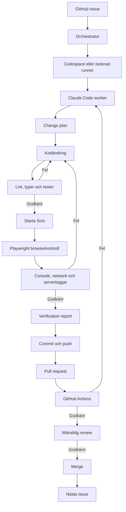

# Runbook — Continuous Improvement Loop med Claude Code, GitHub Codespaces och Playwright

**Status:** Föreslagen implementation  
**Datum:** 2026-08-24  
**Syfte:** Beskriva hur Scio stegvis kan få en säker, evidensstyrd utvecklingsloop som väljer ett avgränsat problem, implementerar en lösning, testar kod och UI, läser loggar, skapar en pull request och därefter går vidare.

> Denna runbook beskriver målarkitektur och installation. Den innebär inte att automationen redan är aktiverad.

---

## 1. Målet

Den önskade loopen är:

1. Läs roadmap, backlog, produktionsgranskningar och ett GitHub Issue.
2. Kontrollera att uppgiften är tillräckligt avgränsad.
3. Skapa en isolerad branch eller worktree.
4. Skriv en maskinläsbar change plan.
5. Ändra endast tillåtna delar av repositoryt.
6. Kör lint, typkontroll och relevanta tester.
7. Starta Scio i en reproducerbar miljö.
8. Använd en riktig browser för att klicka, skriva och kontrollera UI.
9. Läs browser console, nätverksfel och serverloggar.
10. Rätta fel och upprepa tills acceptanskriterierna är uppfyllda eller arbetet blockeras.
11. Dokumentera ändring, testbevis och kvarvarande risker.
12. Commit och push till en issue-specifik branch.
13. Öppna en pull request.
14. Låt GitHub Actions köra oberoende verifiering.
15. Kräv mänskligt godkännande för merge.
16. Välj därefter nästa issue.

Grundprincipen är:

> **Claude Code resonerar och reagerar. Deterministiska tester, scopekontroller, browserassertions och CI avgör om arbetet får betraktas som klart.**

---

## 2. Vad som redan finns i Scio

Repositoryt har redan en stor del av grunden:

- `CLAUDE.md` med arbetsregler, dokumentationskrav och checkpointprotokoll.
- `.devcontainer/devcontainer.json` med Node 20, Python 3.11 och GitHub CLI.
- `.devcontainer/post-create.sh` och `.devcontainer/post-start.sh`.
- `scripts/dev-up.sh` och `scripts/dev-down.sh` för hela stacken.
- `scripts/codespace-env.sh` för Codespaces-domäner och portar.
- `docs/RUNBOOK-CODESPACES.md` för manuell Codespace-start.
- `.github/workflows/ci.yml` med fresh-clone-verifiering.
- Tester för frontend, API och engine.
- Python Playwright i engine för previewobservation.
- Lokala processloggar under `.local/`.
- GitHub Codespaces-portar för app, API och engine.

Det som huvudsakligen saknas är:

- ett standardiserat issueformat för agentarbete;
- Claude Code-konfiguration och skills för loopen;
- deterministiska hooks och tillåtna ändringsytor;
- självständiga browser-e2e-tester för Scio-produktens UI;
- en verifieringsrapport per issue;
- ett workflow för Claude Code och PR-skapande;
- en orchestrator som väljer nästa issue;
- tydliga stopp-, kostnads- och säkerhetsgränser.

---

## 3. Rekommenderad arkitektur



### Två skilda ansvarsområden

#### Orchestrator

Orchestratorn ansvarar för:

- att välja ett godkänt issue;
- att skapa branch och vid behov Codespace;
- att starta en avgränsad Claude Code-körning;
- att sätta timeout, kostnadstak och maximalt antal iterationer;
- att samla artifacts och slutstatus;
- att aldrig starta två skrivande workers på samma branch;
- att inte välja nästa issue förrän föregående körning avslutats kontrollerat.

#### Claude Code worker

Workern ansvarar för exakt ett issue:

- analys och change plan;
- implementation;
- lokala verifieringar;
- browserkontroll;
- dokumentation;
- commit, push och pull request;
- rapportering av `passed`, `failed`, `blocked` eller `needs-review`.

Den ska inte själv välja fritt bland alla produktionsproblem under samma session.

---

## 4. Rekommenderad körmodell

### Första versionen: Claude Code inne i ett Codespace

Det enklaste och mest robusta är att köra Claude Code direkt inne i Codespace:

```text
Codespace
├── Scio-källkod
├── PostgreSQL
├── engine
├── API
├── frontend
├── Claude Code
└── Playwright-browser
```

Fördelar:

- agent, kod, processer och browser finns i samma nätverk;
- browsern kan använda `localhost`;
- ingen automatisk GitHub-inloggning behövs för privata forwarded ports;
- loggar och filer finns på samma maskin;
- samma devcontainer kan användas av både agent och människa;
- färre problem med cookies, CORS och ändrade Codespace-URL:er.

### Senare version: extern orchestrator

När workerloopen är stabil kan en lokal tjänst, GitHub Action eller Claude Agent SDK-applikation:

1. anropa GitHub API eller `gh codespace create`;
2. vänta tills Codespace är tillgängligt;
3. köra kommandon med `gh codespace ssh`;
4. starta Claude Code i icke-interaktivt läge;
5. läsa exitstatus och artifacts;
6. stoppa eller radera Codespace efter körningen.

Att automatiskt öppna Codespace i VS Code med `gh codespace code` är inte nödvändigt för en headless loop. Det skapar ett mänskligt editorfönster men ger inte en robust kanal för UI-automation.

---

## 5. Browserstrategi

### Använd inte VS Code Simple Browser som automation API

Claude Code bör inte försöka klicka i VS Codes interna webview eller godtyckliga extensionpaneler. Det blir beroende av editorlayout, fokus och extensionversioner.

Använd i stället Playwright mot Scio-applikationen.

### Två Playwright-lägen

#### Playwright CLI och permanenta tester

Används för reproducerbara verifieringar som ska kunna köras lokalt och i CI:

- login och projektstart;
- wizard och spec review;
- designfönster;
- build och reveal;
- riktad regenerering;
- version restore;
- fel-, loading- och empty states.

Kritiska upptäckter ska alltid omvandlas till permanenta tester. En MCP-session är inte i sig ett regressionsskydd.

#### Playwright MCP

Används för utforskande och tillståndsfull browserinteraktion:

- öppna en sida;
- läsa accessibility tree;
- hitta kontroller när testet ännu inte finns;
- klicka och skriva;
- läsa console messages;
- granska network requests;
- ta screenshots;
- undersöka ett oväntat UI-tillstånd.

Microsoft rekommenderar CLI/skills för högvolymarbete och MCP när persistent browser state och rik introspektion behövs. Scio bör använda båda, men för olika syften.

### Internt testläge i Codespace

För agentens browserkontroll bör tjänsterna om möjligt nås via loopback:

- app: `http://127.0.0.1:5173`;
- API: `http://127.0.0.1:3000`;
- engine: `http://127.0.0.1:8000`;
- preview: dess lokala dynamiska port.

Det undviker att göra API- och previewportar publika enbart för en agent som redan kör inne i Codespace.

Det befintliga Codespaces-flödet konfigurerar däremot externa `app.github.dev`-URL:er för en browser utanför containern. Skapa därför ett uttryckligt `agent-local`-läge i startscripten i stället för att förlita sig på implicit miljödetektering.

### Mänsklig Codespace-preview

För manuell granskning används fortsatt:

```text
https://<CODESPACE_NAME>-5173.app.github.dev
```

Nuvarande implementation kräver att API-port 3000 görs publik för cross-origin-anrop. Dynamiska previewportar kan också behöva göras publika för iframe-visning. Följ `docs/RUNBOOK-CODESPACES.md`.

---

## 6. Extensions i Codespace

Extensions deklareras under `customizations.vscode.extensions` i `.devcontainer/devcontainer.json`.

### Redan installerade

| Extension | ID | Funktion |
|---|---|---|
| Python | `ms-python.python` | Pythonmiljö och debugging |
| Ruff | `charliermarsh.ruff` | Python lint/format |
| ESLint | `dbaeumer.vscode-eslint` | TypeScript/JavaScript lint |
| Prettier | `esbenp.prettier-vscode` | Formatering |
| Prisma | `Prisma.prisma` | Schema och Prisma-stöd |

### Rekommenderade tillägg

| Extension | ID | Obligatorisk för agent? | Syfte |
|---|---|---:|---|
| Claude Code | `anthropic.claude-code` | Nej, CLI räcker | Interaktiv Claude Code-session i VS Code |
| Playwright Test | `ms-playwright.playwright` | Nej | Mänsklig testkörning, trace viewer och testdebugging |
| GitHub Pull Requests | `GitHub.vscode-pull-request-github` | Nej | Mänsklig PR- och issuehantering |

`anthropic.claude-code` är Anthropics officiella VS Code-extension. Kontrollera ändå alltid publisher och extension-ID mot aktuell Marketplace innan installation. Installera inte inofficiella Claude-extensioner med liknande namn.

Den officiella Chrome-extensionen **Claude in Chrome** kan användas från en interaktiv Claude Code-session för att öppna flikar, använda ett redan inloggat browser-state och läsa console-loggar. Den är användbar för manuell felsökning men ska inte vara den bindande CI-grinden. Playwright-tester är reproducerbara, headless-kompatibla och passar därför bättre för den autonoma loopen.

### Viktig avgränsning

Extensions är stöd för den mänskliga arbetsytan. Den autonoma loopen ska fungera med CLI, MCP, filer och API:er även om inget VS Code-fönster är öppet.

---

## 7. MCP-servrar

### Minsta rekommenderade uppsättning

#### Playwright MCP

Använd den officiella servern från Microsoft för explorativ browserautomation.

Projektkonfigurationen ska ligga i `.mcp.json`. Använd en exakt verifierad version i automation, inte `latest`:

```json
{
  "mcpServers": {
    "playwright": {
      "command": "npx",
      "args": [
        "-y",
        "@playwright/mcp@<PINNED_VERSION>",
        "--headless",
        "--isolated",
        "--browser",
        "chromium",
        "--output-dir",
        ".artifacts/playwright-mcp"
      ]
    }
  }
}
```

Rekommenderade begränsningar:

- isolerad browserprofil per worker;
- endast godkända hosts/origins;
- ingen obegränsad `file://`-åtkomst;
- separat outputkatalog per issue/run;
- inga hemligheter i `.mcp.json`;
- autentiseringsstate via skyddad fil eller testsetup.

Playwright MCP är uttryckligen inte en säkerhetsgräns. Originregler ersätter inte nätverksisolering.

#### GitHub MCP — valfri

GitHub MCP kan användas för issues, pull requests, reviewkommentarer och workflowstatus. GitHub CLI räcker dock för första versionen och ger mindre verktygsyta.

Om GitHub MCP används:

- ge ett fine-grained token med minsta behörighet;
- lagra token i Codespaces Secrets eller annan secret store;
- tillåt endast det aktuella repositoryt;
- tillåt inte merge eller administration;
- lägg aldrig token direkt i `.mcp.json`;
- kräv mänsklig approval för känsliga MCP-tools.

GitHub-operationer i Claude Code GitHub Action kan använda actionens inbyggda GitHub-integration och behöver inte dupliceras med ett separat MCP.

### MCP som kan läggas till senare

| MCP | När den behövs | Rekommenderad rättighet |
|---|---|---|
| Sentry | När staging skickar fel dit | Read-only |
| Azure Monitor | När Scio körs i Azure | Read-only mot staging |
| PostgreSQL/DBHub | Vid diagnostik | Read-only testdatabas |
| Linear/Jira | Endast om GitHub Issues inte är arbetskö | Begränsad project scope |

Lägg inte till MCP-servrar utan ett konkret behov. Varje extern server ökar attackyta och prompt-injection-risk.

---

## 8. Claude Code-konfiguration

### Föreslagen struktur

```text
.claude/
├── settings.json
├── rules/
│   ├── continuous-improvement.md
│   ├── security-boundaries.md
│   └── verification.md
├── skills/
│   └── fix-production-issue/
│       ├── SKILL.md
│       ├── templates/
│       │   ├── change-plan.json
│       │   └── verification-report.md
│       └── scripts/
│           └── validate-issue.mjs
└── hooks/
    ├── guard-paths.mjs
    ├── guard-dangerous-command.mjs
    ├── verify-before-complete.mjs
    └── record-operation.mjs

.mcp.json
.github/
├── ISSUE_TEMPLATE/
│   └── production-fix.yml
├── workflows/
│   ├── ci.yml
│   ├── claude-issue.yml
│   └── browser-e2e.yml
└── pull_request_template.md

.artifacts/                 # gitignored
├── runs/
├── playwright/
└── logs/
```

Detta är en målstruktur. Lägg till delarna stegvis och validera varje nivå innan nästa introduceras.

### `CLAUDE.md`

Behåll befintliga projektregler och komplettera senare med korta hänvisningar till:

- ett issue per körning;
- obligatorisk change plan;
- tillåten ändringsyta;
- testmatris per typ av ändring;
- förbud mot automatisk merge;
- när agenten måste returnera `blocked`;
- var artifacts och verifieringsrapport skrivs.

Undvik att göra `CLAUDE.md` till en lång runbook. Det läses vid varje session. Detaljerad workflowlogik hör hemma i en skill.

### Skill: `fix-production-issue`

Skapa en projekt-skill som tar ett issue-nummer och utför följande:

1. Hämta issue och relaterade dokument.
2. Bekräfta att issue har acceptanskriterier och tillåten scope.
3. Kontrollera aktuell branch och arbetskatalog.
4. Skapa change plan.
5. Implementera minsta korrekta förändring.
6. Kör selektiva tester.
7. Kör hela obligatoriska verifieringspaketet.
8. Starta stacken med fake providers.
9. Kör browserkontroll.
10. Samla artifacts.
11. Uppdatera relevanta dokument.
12. Skapa commit och push.
13. Öppna PR med verifieringsrapport.
14. Avsluta med en maskinläsbar status.

Skillen ska stoppa om:

- issue kräver ett öppet produkt- eller arkitekturbeslut;
- tillåten ändringsyta behöver expanderas väsentligt;
- tester saknas för ett kritiskt beteende;
- agenten behöver en hemlighet den inte har;
- real provider riskerar oväntad kostnad;
- samma fel har rättats och återkommit över ett definierat antal iterationer;
- repositoryt innehåller okända ändringar som kan skrivas över.

### Permissions

Tillåt normalt:

- läsning av repositoryt;
- redigering inom aktiv change plan;
- verifierade `pnpm`, Python-, Playwright- och Git-kommandon;
- push till den egna issue-branchen;
- skapande och uppdatering av den egna pull requesten.

Kräv alltid approval för:

- merge;
- force push;
- ändring av GitHub Actions eller branch protection;
- ändring av secrets;
- databasreset eller destruktiva migrationer;
- produktionsdeployment;
- breda nätverksoperationer;
- förändringar utanför issue-scope.

Neka alltid:

- utskrift av secrets;
- commit av `.env` eller autentiseringsstate;
- push direkt till `master`;
- kringgående av misslyckade tester;
- godtycklig radering utanför arbetskatalogen.

---

## 9. Deterministiska hooks

Hooks ska implementera policy, inte bara ge råd.

### `PreToolUse`

Använd för att:

- blockera push till `master`;
- blockera force push;
- blockera destruktiva shellkommandon;
- kontrollera att ändrade filer ligger inom change plans allow-list;
- kräva approval för workflow-, auth-, migrations- och deploymentfiler;
- logga MCP-anrop och shelloperationer.

På Windows måste hooken matcha både `Bash` och `PowerShell`, annars kan samma policy bete sig olika lokalt och i Codespace.

### `PostToolUse` och `PostToolUseFailure`

Använd för att:

- registrera ändrade filer;
- köra snabb lint för ändrade filer;
- spara fel och kommandostatus;
- ge Claude relevant loggkontext efter ett fel.

Kör inte hela testsviten efter varje filskrivning. Det blir långsamt och skapar parallella testprocesser.

### `TaskCompleted` eller `Stop`

Använd en deterministisk command hook som blockerar slutförande om:

- obligatoriska testresultat saknas;
- verifieringsrapport saknas;
- otillåtna filer ändrats;
- dokumentationen inte uppdaterats;
- branch inte har pushats;
- PR saknas;
- det finns oförklarade testfel.

Command hooks bör vara den bindande grinden. Prompt- och agenthooks kan användas som extra review men inte ensamma bevisa att tester passerat.

### Hook-säkerhet

- Kontrollera all JSON-input.
- Normalisera Windows- och Linux-paths.
- Använd absoluta paths.
- Blockera path traversal.
- Låt aldrig okänd issue- eller loggtext bli ett shellkommando.
- Använd exit code 2 eller dokumenterat JSON-beslut för blockerande hooks.
- Testa fail-closed-beteendet; hook-timeout kan annars innebära att operationen fortsätter.

---

## 10. GitHub Issues som exekverbar arbetskö

### Obligatoriska fält

Varje agentkörbart issue ska innehålla:

```text
Problem
Förväntat beteende
Observerat beteende
Säkerhets-/produktinvariant
Tillåten ändringsyta
Förbjuden ändringsyta
Acceptanskriterier
Obligatoriska tester
Browser-scenario
Loggar/evidens som ska sparas
Dokument som ska uppdateras
Stop conditions
```

### Föreslagna labels

| Label | Betydelse |
|---|---|
| `agent-ready` | Tillräckligt specificerat för automation |
| `agent-running` | En worker äger uppgiften |
| `agent-blocked` | Kräver mänskligt beslut eller credential |
| `needs-human-review` | Implementation klar, beslut återstår |
| `priority:P1` | Produktionsblockerande eller kärnkritiskt |
| `area:api` | API-ändring |
| `area:engine` | Engine-ändring |
| `area:app` | Frontendändring |
| `area:security` | Säkerhetskänslig förändring |
| `browser-required` | Måste verifieras i riktig browser |
| `adr-required` | Får inte implementeras innan ADR är godkänd |

Orchestratorn får endast välja öppna issues med `agent-ready` och utan `agent-running`, `agent-blocked` eller `adr-required`.

### Rekommenderad prioritetsordning

Börja med små och verifierbara P1-fel från produktionsgranskningen:

1. tenantkontroll före idempotensreplay;
2. heartbeat/lease och reaper;
3. spend-korrelation till rätt build attempt;
4. verifieringsrapport;
5. browser-e2e för ett kritiskt happy path.

Kör inte automationens första pilot på queue/worker-ombyggnad eller produktionsdeployment.

---

## 11. Change plan

Före första kodändringen ska workern skapa en plan, exempelvis under `.artifacts/runs/<run-id>/change-plan.json`:

```json
{
  "issue": 123,
  "branch": "fix/123-tenant-replay",
  "problem": "Replay sker före verifierad workspace ownership",
  "invariants": [
    "A build may only be observed or replayed by its owning workspace"
  ],
  "allowedPaths": [
    "apps/api/src/build/**",
    "apps/api/test/**",
    "docs/**"
  ],
  "forbiddenPaths": [
    ".github/workflows/**",
    "apps/api/prisma/migrations/**"
  ],
  "requiredChecks": [
    "api-unit",
    "api-e2e",
    "tenant-regression"
  ],
  "browserRequired": false
}
```

Filen ska genereras från issueinnehållet och valideras av ett script. Om scope måste utökas ska workern stoppa eller begära godkännande, inte tyst skriva om planen.

`.artifacts/` ska vara gitignored. Slutrapporten kan kopieras till PR-kommentaren och vid behov till relevant permanent dokumentation.

---

## 12. Test- och verifieringslager

### Snabb feedback

Efter en fokuserad ändring körs relevanta pakettester:

```bash
pnpm --filter @scio/api test
pnpm --filter @scio/app test
apps/engine/.venv/bin/python -m pytest apps/engine -q
```

Kör endast de delar som berörs under den inre loopen.

### Obligatorisk lokal slutgrind

Före commit ska minst samma kontroller som CI köras:

```bash
pnpm --filter @scio/shared build
pnpm -r lint
apps/engine/.venv/bin/python -m ruff check apps/engine/src apps/engine/tests
SCIO_SKIP_ENV_FILE=1 apps/engine/.venv/bin/python -m pytest apps/engine -q
pnpm --filter @scio/api test
pnpm --filter @scio/app test
```

Den exakta kommandokedjan bör kapslas i ett versionshanterat script, exempelvis `scripts/verify.sh`, så Claude, utvecklare och CI kör samma kontrakt.

### Browser-e2e

Lägg till en separat Playwright-testsvit för produkt-UI. Den ska minst verifiera:

1. appen laddas utan console errors;
2. dev login fungerar;
3. ett projekt kan skapas;
4. wizard kan genomföras;
5. spec review kan godkännas;
6. designfönstret visar preview;
7. ett element kan markeras;
8. en riktad ändring kan begäras;
9. build når reveal;
10. resultat och honest status visas korrekt.

Börja med fake providers. Kör real-provider-smoke separat, manuellt eller med budgettak.

### Browser artifacts

Spara vid misslyckande:

- screenshot;
- Playwright trace;
- console messages;
- misslyckade network requests;
- aktuell URL;
- DOM/accessibility snapshot där det behövs;
- API-, engine- och app-loggarnas relevanta tail.

---

## 13. Loggar

### Befintliga lokala loggar

`scripts/dev-up.sh` skriver processinformation och loggar under `.local/`. Workern ska läsa dessa vid startfel och browserfel i stället för att gissa orsaken.

### Föreslagen körkatalog

```text
.artifacts/runs/<run-id>/
├── issue.json
├── change-plan.json
├── commands.jsonl
├── tests/
├── browser/
├── logs/
│   ├── app.log
│   ├── api.log
│   └── engine.log
└── verification-report.json
```

### Korrelationsfält

Varje run bör bära:

- `runId`;
- issue-nummer;
- branch;
- commit SHA;
- Claude session-id;
- Codespace-namn;
- test-run-id;
- build-id där ett Scio-bygge skapats.

Secrets och fullständiga tokens ska redigeras bort före lagring eller uppladdning.

---

## 14. GitHub Actions

### Behåll befintlig CI som oberoende grind

`.github/workflows/ci.yml` ska fortsätta köra från en färsk clone utan beroende av agentens lokala cache. Det är viktigt eftersom flera tidigare fel endast syntes i en ren miljö.

### Claude Code Action

Claude Code GitHub Action kan installeras genom Claude Codes officiella GitHub App eller manuellt. Den kan:

- reagera på `@claude` i ett issue eller en PR;
- köra ett bestämt prompt/skill på ett GitHub-event;
- ändra filer;
- pusha commits;
- skapa eller uppdatera pull requests;
- läsa CI-resultat när rättigheter ges.

För Scio bör första workflowet vara manuellt eller issue-triggerat, inte schemalagt:

```yaml
name: Claude issue worker

on:
  workflow_dispatch:
    inputs:
      issue:
        description: GitHub issue number
        required: true

concurrency:
  group: claude-issue-${{ inputs.issue }}
  cancel-in-progress: false

jobs:
  implement:
    runs-on: ubuntu-latest
    timeout-minutes: 45
    permissions:
      contents: write
      issues: write
      pull-requests: write
      actions: read
      id-token: write
    steps:
      - uses: actions/checkout@<PINNED_SHA>
      - uses: anthropics/claude-code-action@<PINNED_SHA>
        with:
          anthropic_api_key: ${{ secrets.ANTHROPIC_API_KEY }}
          prompt: "/fix-production-issue ${{ inputs.issue }}"
          claude_args: >-
            --max-turns <LIMIT>
            --allowedTools <EXPLICIT_ALLOWLIST>
```

Detta är ett mönster, inte en färdig workflowfil. Innan implementation:

- pinna actions till full commit-SHA;
- definiera explicit tool allow-list;
- sätt timeout och max-turns;
- använd environment protection för känsliga steg;
- verifiera att CI triggas av agentens commits;
- ge inte workflowet merge- eller administratörsrättighet.

### Browser-e2e-workflow

Browser-e2e bör vara ett separat required check som:

1. installerar låsta dependencies;
2. installerar rätt Chromium-version;
3. startar teststacken med fake providers;
4. väntar på health endpoints;
5. kör Playwright-testsviten;
6. laddar upp report, trace, screenshots och loggar;
7. alltid stänger processer.

### Full Codespace-orchestration

Att skapa ett Codespace från GitHub Actions är möjligt med GitHub API/CLI och rätt token, men bör inte vara första lösningen:

- det kräver ytterligare tokenrättigheter;
- det kostar Codespaces-tid utöver Actions;
- lifecycle och cleanup måste hanteras;
- en kvarlämnad Codespace kan fortsätta kosta;
- GitHub-hosted runner är redan en ren Linuxmiljö för CI.

Använd Codespace när dess fullständiga utvecklingsmiljö ger ett konkret värde. Använd vanlig Actions-runner för standardiserade tester.

---

## 15. Secrets och autentisering

### Separata secret stores

- GitHub Actions secrets används av workflows.
- GitHub Codespaces secrets används inne i Codespaces.
- Lokala Claude Code-credentials stannar lokalt.
- Testauth/storage state sparas utanför Git.

Minsta möjliga tokenbehörighet ska användas.

### Rekommenderade secrets

| Secret | Miljö | Kommentar |
|---|---|---|
| `ANTHROPIC_API_KEY` eller Claude OAuth-token | Actions/Codespaces | Separata credentials om möjligt |
| GitHub App/token | Orchestrator | Endast aktuellt repo, ingen admin/merge |
| Clerk test secret | E2E vid behov | Endast testinstans |
| Provider keys för Scio | Separat real-build-workflow | Inte i standardloopen |

Nuvarande Codespace-flöde använder dev auth när Clerk inte konfigurerats. Det är lämpligt för den första browserloopen.

### Förbjudet

- Secrets i promptar, issues eller PR-kommentarer.
- Secrets i `.mcp.json`.
- Commit av `.env`, Playwright storage state eller tokenloggar.
- Produktionscredentials i ett generellt agent-Codespace.
- Automatisk utskrift av environment variables vid felsökning.

---

## 16. Säkerhet mot prompt injection

Issues, loggar, webbsidor och MCP-resultat är otillförlitlig input. Texten kan innehålla instruktioner som försöker få agenten att läsa secrets eller ändra scope.

Skydd:

1. Ett issue blir inte `agent-ready` utan mänsklig triage.
2. Change plan skapas före externa sidbesök.
3. Permissions och hooks är bindande även om prompten säger annat.
4. Browsern får bara nå allow-listade lokala/staging-origins.
5. GitHub-token begränsas till ett repo.
6. Produktionsmiljö och produktionstelemetri är read-only.
7. Agenten får inte merge- eller deploymentsrättighet.
8. Extern text får aldrig interpoleras till shell.
9. Varje MCP-server granskas och pinnas innan aktivering.
10. Okänt scope ger `blocked`, inte improvisation.

---

## 17. Verification report

Varje lyckad eller blockerad körning ska lämna en maskinläsbar rapport:

```json
{
  "runId": "2026-08-24-issue-123-a1b2c3",
  "issue": 123,
  "status": "passed",
  "branch": "fix/123-tenant-replay",
  "commit": "<sha>",
  "changedFiles": [],
  "scopeViolations": [],
  "checks": [
    { "name": "api-tests", "status": "passed" },
    { "name": "browser-e2e", "status": "not-required" }
  ],
  "artifacts": [],
  "documentationUpdated": [],
  "remainingRisks": [],
  "pullRequest": "<url>"
}
```

Tillåtna slutstatusar:

- `passed` — alla obligatoriska kontroller passerade och PR skapades;
- `failed` — implementation eller verifiering misslyckades;
- `blocked` — ett mänskligt beslut, credential eller beroende saknas;
- `needs-review` — tekniskt genomförbart men scope/risk kräver människa.

“Passed” får inte användas om ett obligatoriskt test hoppats över.

---

## 18. Kontinuerlig loop och stoppregler

### Tillåten automatisk fortsättning

Orchestratorn får välja nästa issue endast när:

- föregående run är avslutad;
- branch och PR finns;
- artifacts är uppladdade;
- CI har startat;
- inget workspace eller Codespace fortfarande ägs av en worker;
- kostnads- och concurrencytak tillåter nästa run.

Det rekommenderas att nästa issue inte startas förrän föregående PR är granskad och merged under den första perioden. Annars riskerar flera agentskapade branches att bygga på en inaktuell bas.

### Obligatoriskt stopp

Stoppa loopen när:

- ett P1-test misslyckas efter maximalt antal försök;
- ett arkitektur- eller produktbeslut saknas;
- change scope expanderar utanför issue;
- en säkerhetsinvariant påverkas oväntat;
- en credential saknas eller har gått ut;
- Codespace eller GitHub API inte kan nås;
- budgettak har nåtts;
- CI visar ett fel som inte kan reproduceras;
- två workers försöker äga samma issue eller branch;
- merge conflict kräver produktförståelse;
- real-provider-kostnad skulle uppstå utan explicit tillstånd.

---

## 19. Stegvis införande

### Steg 0 — besluta kontrollmodell

Dokumentera i ett ADR:

- om workern primärt kör i Codespace eller Actions;
- vem som får trigga agenten;
- vilka verktyg som tillåts;
- vilka steg som kräver människa;
- artifact retention;
- kostnadsgränser;
- om GitHub MCP behövs eller om `gh` räcker.

### Steg 1 — gör testkontraktet enhetligt

- Lägg till ett centralt verifieringsscript.
- Kör samma script lokalt, i Codespace och i CI.
- Kontrollera att det fungerar från fresh clone.
- Behåll fake providers som standard.

**Exitkriterium:** en människa kan köra ett kommando och få ett entydigt godkänt/underkänt resultat.

### Steg 2 — lägg till browser-e2e

- Välj teststruktur och pinna Playwright.
- Implementera ett enda kritiskt happy path.
- Spara trace, screenshots och loggar vid fel.
- Kör testet i Codespace och GitHub Actions.

**Exitkriterium:** ett medvetet UI-fel ger ett reproducerbart rött test och användbar evidens.

### Steg 3 — installera Claude Code-konfiguration

- Lägg till skillen `fix-production-issue`.
- Lägg till permissions och hooks.
- Lägg till change plan och verification report-schema.
- Testa att scopebrott och misslyckade tester verkligen blockerar slutförande.

**Exitkriterium:** agenten kan inte deklarera klart när obligatorisk evidens saknas.

### Steg 4 — kör ett manuellt pilot-issue

Använd tenantkontrollen före idempotensreplay som första kandidat:

- tydligt säkerhetsfel;
- liten ändringsyta;
- går att regressionstesta;
- kräver inte browser;
- kräver inget nytt produktbeslut.

Starta skillen manuellt inne i Codespace och granska varje steg.

**Exitkriterium:** korrekt PR med test, dokumentation, rapport och inga orelaterade ändringar.

### Steg 5 — aktivera GitHub Action

- Installera officiell Claude GitHub App.
- Lägg till secret.
- Skapa manuellt `workflow_dispatch`-workflow.
- Begränsa tool access, turns, timeout och concurrency.
- Kräv befintlig CI före merge.

**Exitkriterium:** issue-nummer kan starta en isolerad körning som lämnar en granskningsbar PR.

### Steg 6 — lägg till UI-pilot

Välj ett avgränsat frontendproblem och kräv:

- Playwrightinteraktion;
- screenshot/trace;
- console- och networkkontroll;
- permanenta regressionstester.

**Exitkriterium:** agenten upptäcker ett visuellt/funktionellt fel, rättar det och bevisar resultatet i browser.

### Steg 7 — lägg till orchestrator

Först nu får ett controller-script eller Agent SDK-program:

- hitta nästa `agent-ready` issue;
- claima det atomiskt;
- skapa miljö och branch;
- starta worker;
- publicera resultat;
- städa miljön;
- gå vidare enligt stoppreglerna.

**Exitkriterium:** minst fem issues har genomförts utan scopebrott, förlorad evidens, läckta secrets eller manuellt räddningsarbete.

---

## 20. Rekommenderad initial daglig drift

1. En människa prioriterar och märker issues `agent-ready`.
2. Automation kör högst ett issue åt gången.
3. Agenten arbetar på egen branch.
4. Agenten får skapa PR men inte merge.
5. CI och browser-e2e är required checks.
6. En människa granskar kod, evidens och scope.
7. PR mergas eller skickas tillbaka.
8. Nästa issue aktiveras först därefter.
9. Veckovis granskas kostnad, felmönster och hur ofta agenten blockerats.
10. Vanliga fel omvandlas till nya tester, hooks eller tydligare issuefält.

Det är denna sista punkt som gör loopen kontinuerligt bättre: lärdomar ska flyttas från tillfällig agentkontext till permanenta tester, regler och verktyg.

---

## 21. Kostnadskontroll

Sätt gränser på fyra nivåer:

1. Claude Code `max-turns` per issue.
2. GitHub Actions timeout och concurrency.
3. Codespaces machine type, idle timeout och retention.
4. Scio providerbudget och fake-provider-standard.

Mät per issue:

- Claude-tokenkostnad;
- GitHub Actions-minuter;
- Codespaces-tid;
- real-provider-kostnad i Scio;
- antal fix/test-iterationer;
- total ledtid till granskad PR.

Stoppa och analysera om agenten använder fler iterationer utan att felantalet minskar.

---

## 22. Definition of Done för automationen

Automationen är inte färdig bara för att Claude kan skapa en commit. Den första versionen är klar när:

- ett issue kan valideras maskinellt;
- endast ett issue hanteras per worker;
- change scope kan enforcas;
- full verifiering kan köras med ett kommando;
- ett riktigt UI-flöde verifieras i Playwright;
- console, network och serverloggar samlas;
- misslyckade tester blockerar completion;
- artifacts laddas upp;
- PR skapas med verifieringsrapport;
- CI kör från en färsk clone;
- agenten saknar merge- och produktionsrättighet;
- secrets inte förekommer i repository eller artifacts;
- Codespace alltid stoppas eller återanvänds enligt policy;
- fem pilot-issues har genomförts utan kritisk incident.

---

## 23. Rekommenderad första leverans

Första leveransen bör begränsas till:

1. ADR för automationens kontroll- och säkerhetsmodell.
2. Issue template och labels.
3. Ett gemensamt verifieringsscript.
4. En minimal Playwright-e2e-svit.
5. Playwright MCP med pinnad version.
6. Claude Code-skill för exakt ett issue.
7. Hooks för scope, farliga kommandon och completion.
8. Manuellt `workflow_dispatch` för Claude Code Action.
9. Verification report och artifacts.
10. Ett genomfört pilot-issue.

Bygg inte automatisk issue-selektion eller obegränsad loop innan denna leverans fungerat reproducerbart.

---

## 24. Officiella referenser

- Claude Code MCP: <https://code.claude.com/docs/en/mcp>
- Claude Code hooks: <https://code.claude.com/docs/en/hooks>
- Claude Code GitHub Actions: <https://code.claude.com/docs/en/github-actions>
- Claude Code i VS Code: <https://code.claude.com/docs/en/vs-code>
- Claude Code installation: <https://code.claude.com/docs/en/setup>
- Microsoft Playwright MCP: <https://github.com/microsoft/playwright-mcp>
- GitHub CLI för Codespaces: <https://docs.github.com/en/codespaces/developing-in-a-codespace/using-github-codespaces-with-github-cli>
- Codespaces port forwarding: <https://docs.github.com/en/codespaces/developing-in-a-codespace/forwarding-ports-in-your-codespace>

Verifiera syntax och versionsnummer mot dessa källor när implementationen påbörjas. Pinna därefter alla actions, npm-paket och MCP-servrar till granskade versioner eller commit-SHA:n.

---

## 25. Praktisk installationsordning

Följ denna ordning för att gå från dagens repository till den första fungerande piloten.

### 25.1 GitHub

1. Säkerställ att repositoryt finns på GitHub och att GitHub Codespaces är aktiverat.
2. Skapa labels från avsnitt 10.
3. Skapa issue-templaten men aktivera ännu ingen automatisk schemakörning.
4. Aktivera branch protection för `master`:
  - pull request krävs;
  - `.github/workflows/ci.yml` är required check;
  - direkt push och force push blockeras;
  - minst en mänsklig review krävs för agentskapade PR:er.
5. Lägg till Codespaces secret för Claude Code-autentisering om workern ska köras där.
6. Lägg separat Actions secret om Claude Code GitHub Action ska användas.
7. Installera inte GitHub App förrän permissions och workflow har granskats.

Använd aldrig samma kraftfulla personliga token för Codespace, MCP och GitHub Actions. Separera credentials efter funktion och miljö.

### 25.2 Devcontainer

1. Lägg de tre rekommenderade VS Code-extensionerna till den befintliga extensionlistan.
2. Installera Claude Code CLI i devcontainer-image eller `post-create.sh` från en verifierad version.
3. Verifiera installationen med `claude --version` och `claude doctor`.
4. Installera Playwrights Chromium och systemdependencies i image/post-create.
5. Lägg till ett healthcheck-script som väntar på app, API och engine.
6. Lägg till ett `agent-local`-startläge som använder loopback för agentens browser.
7. Kontrollera att en helt ny Codespace kan starta utan manuellt installerade artifacts.

För en interaktiv testinstallation i Codespace rekommenderar Anthropic den native Linux-installationen:

```bash
curl -fsSL https://claude.ai/install.sh | bash -s stable
claude --version
claude doctor
```

För reproducerbar automation bör en granskad exakt version installeras i stället för ett flytande channelnamn. Uppgradering görs sedan genom en separat dependency-PR.

### 25.3 Browserverktyg

1. Lägg till en pinnad `@playwright/test`-dependency i det workspace som ska äga produktens browser-e2e.
2. Skapa Playwright-konfiguration för Chromium, trace, screenshot och HTML/JUnit-report.
3. Implementera ett minimalt smoke test mot appens health/startvy.
4. Implementera därefter ett kritiskt användarflöde.
5. Lägg till den officiella Playwright MCP-servern i `.mcp.json`.
6. Godkänn den projektlokala MCP-konfigurationen i en interaktiv Claude Code-session.
7. Kör `claude mcp list` och kontrollera att servern är ansluten.
8. Begränsa browsern till Scio-origins och isolera browserprofil per run.

Playwright-extensionen i VS Code är endast ett gränssnitt för utvecklaren. `@playwright/test` och browserbinären måste fortfarande installeras i miljön.

### 25.4 Claude Code

1. Installera den officiella VS Code-extensionen `anthropic.claude-code` för interaktiv användning.
2. Installera standalone CLI eftersom extensionens bundlade CLI inte automatiskt hamnar på `PATH`.
3. Logga in interaktivt eller tillför en dedikerad secret i Codespace.
4. Skapa `.claude/settings.json` med schema, minsta permissions och stabil update policy.
5. Implementera först read-only/audit-hooks och kontrollera debugloggen.
6. Lägg därefter till blockerande hooks och testa både tillåtet och nekat beteende.
7. Skapa skillen `fix-production-issue`.
8. Kör skillen manuellt på ett testissue utan kodändring.
9. Kör den på pilotissuet först när issuevalidering, change plan och verifieringsrapport fungerar.

Starta Claude Code med en namngiven debuglogg under pilotfasen så hook- och MCP-problem kan diagnostiseras. Debugloggen får inte laddas upp innan secrets har redigerats bort.

### 25.5 GitHub Action

1. Installera Anthropics officiella GitHub App med repositorybegränsad åtkomst.
2. Lägg till API- eller OAuth-secret enligt den officiella dokumentationen.
3. Skapa ett manuellt `workflow_dispatch`-workflow.
4. Begränsa actions permissions och Claude tools.
5. Pinna samtliga actions till granskade commit-SHA:n.
6. Sätt `max-turns`, workflow-timeout och concurrency.
7. Testa med en read-only-uppgift.
8. Testa därefter en dokumentations-PR.
9. Först därefter tillåts kodändringar.
10. Behåll mänsklig merge och required CI checks.

### 25.6 Orchestrator

Orchestratorn byggs sist. Börja med ett litet script eller Agent SDK-program som endast:

1. listar `agent-ready` issues;
2. låser ett issue genom label/comment;
3. startar en worker;
4. väntar på strukturerad slutstatus;
5. publicerar rapport och artifacts;
6. tar bort låset vid kontrollerat avslut;
7. stoppar Codespace när policyn kräver det.

Lägg inte till automatisk “välj nästa” förrän samma process genomförts manuellt minst fem gånger.

---

## 26. Första pilotkörningen

### Förberedelse

1. Skapa ett issue för tenantkontroll före idempotensreplay.
2. Fyll samtliga obligatoriska issuefält.
3. Märk det `agent-ready`, `priority:P1`, `area:api` och `area:security`.
4. Skapa en ny Codespace från aktuell `master`.
5. Kontrollera att `claude`, `gh`, Node, pnpm, Python och Playwright fungerar.
6. Starta Scio med fake providers.
7. Kontrollera health endpoints och befintlig CI-baslinje.

### Worker

1. Starta `fix-production-issue` med issue-numret.
2. Granska change plan innan första pilotens implementation.
3. Låt workern ändra kod och regressionstest.
4. Låt den köra API-tester och full lokal verifiering.
5. Bekräfta att browsertest markeras `not-required`, inte falskt `passed`.
6. Kontrollera att endast tillåtna filer förändrats.
7. Låt workern uppdatera dokumentation och verifieringsrapport.
8. Låt workern commit:a, pusha och öppna PR.

### Oberoende kontroll

1. Låt GitHub Actions köra från fresh clone.
2. Granska PR-diff och testbevis manuellt.
3. Kontrollera att säkerhetsregressionstestet verkligen misslyckas utan fixen.
4. Mät tid, tokens, antal iterationer och manuella ingripanden.
5. Merge endast efter godkänd review.
6. Skriv varje upptäckt automationsbrist som ett separat förbättringsissue.

Piloten är godkänd när den skapar en korrekt, liten och reproducerbart verifierad PR utan att agenten har fått merge-, produktions- eller obegränsade shellrättigheter.
